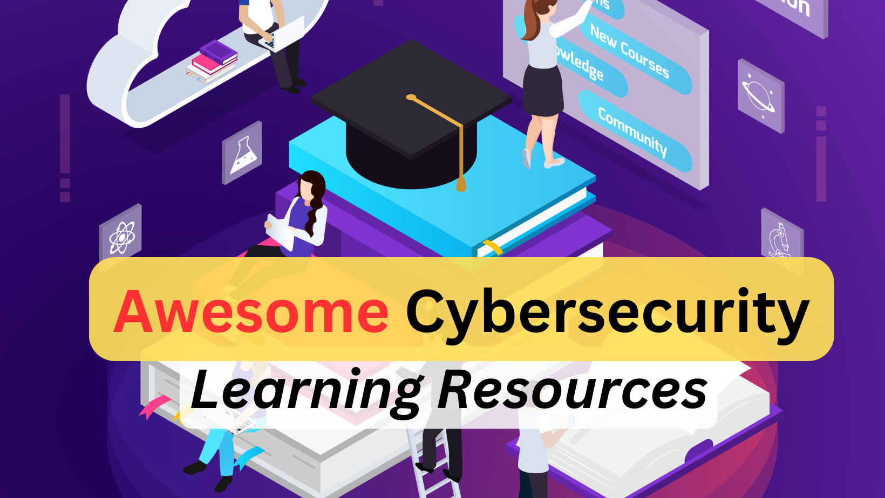

# Awesome Cybersecurity Learning resources
A single place to get every possible learning resources for cybersecurity that includes YouTube videos, GitHub repositories, books, videos, courses, labs, certifications, articles, newsletters etc. 
We would keep adding relevant learning references when we find them informative for our community.

> [!NOTE]
> **You can also star or fork our other important repositories listed below:**
1. [Security Study Plan](https://github.com/jassics/security-study-plan)
2. [Security Interview Questions](https://github.com/jassics/security-interview-questions)
3. [Awesome AWS Security](https://github.com/jassics/awesome-aws-security)
4. [Cybersecurity career roadmap](https://github.com/jassics/cybersecurity-roadmap)
5. [Cybersecurity FAQs](https://github.com/jassics/cybersecurity-career-faq)
6. [Cybersecurity Slides](https://github.com/jassics/cybersecurity-slides)
7. [Python for Cybersecurity](https://github.com/jassics/python-for-cybersecurity)

> [!TIP]
> **We have categorised the learning resources based on the below domains (subject to change):**
1. [Common Learning Resources](README.md)
2. [Penetration Testing learning resources](awesome-pentest-learning-resources.md)
3. [Network security learning resources](awesome-network-security-learning-resources.md)
4. [API security learning resources](awesome-api-security-learning-resources.md)
5. [Application security learning resources](awesome-appsec-learning-resources.md)
6. [DevSecOps learning resources](awesome-devsecops-learning-resources.md)
7. [AI/ML security learning resources](awesome-aiml-security-learning-resources.md)
8. [Cloud security learning resources](awesome-cloud-security-learning-resources.md)
9. [GRC learning resources](awesome-grc-learning-resources.md)
10. [Mobile Application Security resources](awesome-mobile-security-learning-resources.md)

## ToC
1. [Books](#must-read---security-books)
2. [Cybersecurity Videos](#cybersecurity-videos)
3. [Free/Paid Cybersecurity Courses](#freepaid-cybersecurity-courses)
4. [Free/Paid Cybersecurity Labs](#freepaid-cybersecurity-labs)
6. [Certifications](#certifications)
7. [Newsletters](#newsletters)
8. [Blogs/Articles](#blogsarticles)
9. [Security Events/Conferences](#security-eventsconferences)

## Must Read - Security Books
**Books that you must read in your cybersecurity journey**

1. [Secure By Design](https://amzn.to/47Ow952) - Highly Recommended
2. [Security Engineering 3rd Edition](https://amzn.to/3ZRHnUv)
3. [The Web Application Hacker's Handbook](https://www.amazon.in/Web-Application-Hackers-Handbook-Exploiting) - This was my first book when I started working as a Penetration Tester in 2014
4. [Thinking Security](https://amzn.to/3BCptLg)
5. [Schneier on Security](https://amzn.to/4eOuKxS) - Little ol now, but still very much useful to give you an idea of overall security notion. I enjoyed reading it!

## Cybersecurity Videos

## Free/Paid Cybersecurity Courses

## Free/Paid Cybersecurity Labs
1. hackthebox
2. tryhackme

## Security Certifications
**We are keeping the certifications which are popular amongst security community and what HR asks.**
1. CC from ISC2
2. CompTIA Security+
3. CISSP

 <b>1. ISC2</b> 

1. CC - Entry-level Cybersecurity
2. CISSP - Leadership and Operations
3. CSSLP - Secure Software Development
4. SSCP - Security Administrator
5. CCSP - Cloud Security
6. CGRC - Governance, Risk and Compliance

 <b>2. EC-Council</b>

1. C|EH - Ethical Hacker
2. E|CSA
3. C|HFI
4. C|CISO
5. C|Pent - Penetration Testing
6. C|SA - SOC Analyst
7. E|CIH - Incident Handler
8. E|CDE - DevSecOps
9. CASE.Net - Application Security
10. CASE.Java - Application Security

<b>3. CompTIA</b>

1. Security+
2. CySA+
3. Pentest+
4. CASP+

 <b>4. eLearn Security</b>

   1. eJPT
   2. eWPT
   3. eWPTX 
   4. eCPPT

 <b>5. Offensive Security</b> 

   1. OSCP 
   2. OSEP 
   3. OSWP 
   4. OSWA 
   5. OSWE

 <b>6. Cloud Security Alliance</b>

   1. CCSK 
   2. CCAK

<b>7. CNCF Certs</b>

   1. KCNA - Kubernetes and Cloud Native Associate
   2. CKA 
   3. CKS

 <b>8. SANS Certs</b> 

1. GCSA
2. GCLD
3. GCPN
4. GWEB
5. GCSA
6. GSEC
7. GWAPT
8. GSLC - GIAC Security Leadership

 <b>9. Practical DevSecOps Certs</b>

1. CDP
2. CDE
3. CCSE
4. CCNSE
5. CTMP
6. CASP
7. CSSE
8. CSC
9. CAISP

 <b>10. APISec Certs</b> 

1. CASA - Certified API Security Analyst
2. ASCP - API Security Certified Professional

## Security Newsletters
1. [The Hacker News](https://thehackernews.com/#email-outer)
2. [TLDR Sec](https://tldrsec.com/)
3. [CSO Online](https://www.csoonline.com/newsletters/signup/)
4. [Cyber Magazine](https://cybermagazine.com/)
5. [Dark Reading](https://www.darkreading.com/newsletter-signup/) Recommended :thumbsup:
6. [API Security](https://apisecurity.io/)
7. [AWS Security](https://awssecuritydigest.com/)
8. [Cloud Security](https://cloudseclist.com/)
9. [One more for cloud security](https://www.cloudsecuritynewsletter.com/)
10. [SANS Newsletter](https://www.sans.org/newsletters/)
11. [Schneier on Security](https://www.schneier.com/crypto-gram/) -> Very interesting one :ok_hand:
12. [Zero Day issues newsletter](https://www.zetter-zeroday.com/)
13. [Krebs on Security](https://krebsonsecurity.com/subscribe/)
14. [Security Magazine](https://www.securitymagazine.com/)

## Security: Blogs/Articles

## Security Events/Conferences
You can try to present, attend and meet like-minded people in these security chapters or conferences.
Look for the local chapters near you like Bsides bangalore, Null Hyderabad, Nullcon Goa etc.

| Meetup/Conferences                                       | Type          |
|----------------------------------------------------------|---------------|
| [Null](https://null.community/)                          | Chapters      |
| [Nullcon](https://nullcon.net/)                          | International |
| [Defcon](https://defcon.org/)                            | International |
| [Blackhat](https://www.blackhat.com/)                    | International |
| [OWASP](https://owasp.org/chapters/)                     | Chapters      |
| Bsides                                                   | Chapters      |
| [CXO Cywayz](https://cxocywayz.com/)                     | Chapters      |
| [The Hacker's Meetup](https://thehackersmeetup.org/)     | Chapters      |
| [Bi0s](https://bi0s.in/)                                 | Chapters      |
| [ISC2](https://www.isc2.org/chapters)                    | Chapters      |
| [ISACA](https://www.isaca.org/membership/local-chapters) | Chapters      |
| [DevSecCon by Snyk](http://devseccon.com/)               | International|

> [!NOTE]
> This list is not holistic, but we can make it more comprehensive together. So, if you want to add any learning resources, fork the repository and send PR or contact **Sanjeev** on [Linkedin](https://www.linkedin.com/in/jassics/)