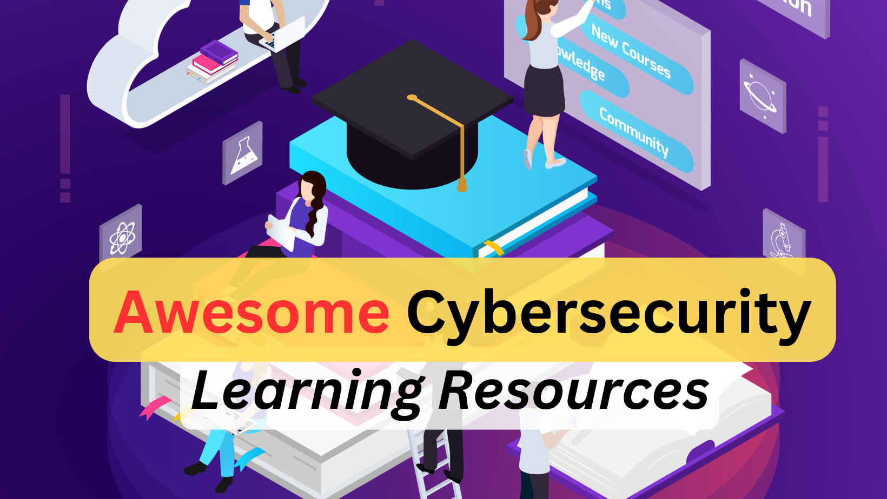

# Awesome Cybersecurity Learning resources
In one place, learning resources for cybersecurity include YouTube, GitHub, books, videos, courses, labs, articles, etc. We would keep adding relevant learning references when we find them informative for our community.

> [!NOTE]
> **You can also star or fork our other important repositories listed below:**
1. [Security Study Plan](https://github.com/jassics/security-study-plan)
2. [Security Interview Questions](https://github.com/jassics/security-interview-questions)
3. [Awesome AWS Security](https://github.com/jassics/awesome-aws-security)
4. [Cybersecurity career roadmap](https://github.com/jassics/cybersecurity-roadmap)
5. [Cybersecurity FAQs](https://github.com/jassics/cybersecurity-career-faq)
6. [Cybersecurity Slides](https://github.com/jassics/cybersecurity-slides)
7. [Python for Cybersecurity](https://github.com/jassics/python-for-cybersecurity)

> [!TIP]
> **We have categorised the learning resources based on the below domains (subject to change):**
1. Common topics
2. Penetration testing learning resources
3. Network security learning resources
4. API security learning resources
5. Application security learning resources
6. DevSecOps learning resources
7. AI/ML security learning resources
8. Cloud security learning resources
9. GRC learning resources
