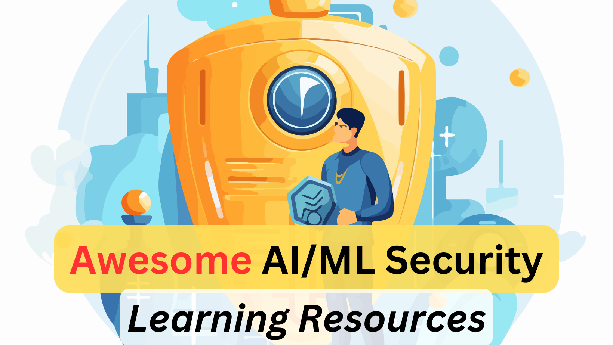

# Awesome AI/ML Security Learning Resources

## ToC
1. [Books](#books)
2. [Videos](#videos)
3. [Free/Paid Courses](#freepaid-courses)
4. [Free/Paid Labs](#freepaid-labs)
5. [Certifications](#certifications)
6. [Blogs/Articles](#blogsarticles)
7. [AI/ML Security Tools](#aiml-security-tools)

## Books

## Videos

## Free/Paid Courses

## Free/Paid Labs

## AI/ML Security Certifications

## Blogs/Articles
1. [LLM CS-324 from Stanford University](https://stanford-cs324.github.io/winter2022/)
2. [COS 597G (Fall 2022): Understanding Large Language Models from Princeton University](https://www.cs.princeton.edu/courses/archive/fall22/cos597G/)
3. [Intro to LLM Security from WhyLabs (Youtube)](https://www.youtube.com/watch?v=dj1H4g4YSlU)
4. [GenAI with LLM from Coursera](https://www.coursera.org/learn/generative-ai-with-llms#modules)
5. [LLM Security](https://llmsecurity.net/)
6. [LLM AI Security and Governance Checklist from OWASP](https://owasp.org/www-project-top-10-for-large-language-model-applications/llm-top-10-governance-doc/LLM_AI_Security_and_Governance_Checklist.pdf)
7. [OWASP Top 10 for LLM Application](https://owasp.org/www-project-top-10-for-large-language-model-applications/assets/PDF/OWASP-Top-10-for-LLMs-2023-v1_1.pdf)
8. [Web LLM attacks from portswigger](https://portswigger.net/web-security/llm-attacks)

## AI/ML Security Tools