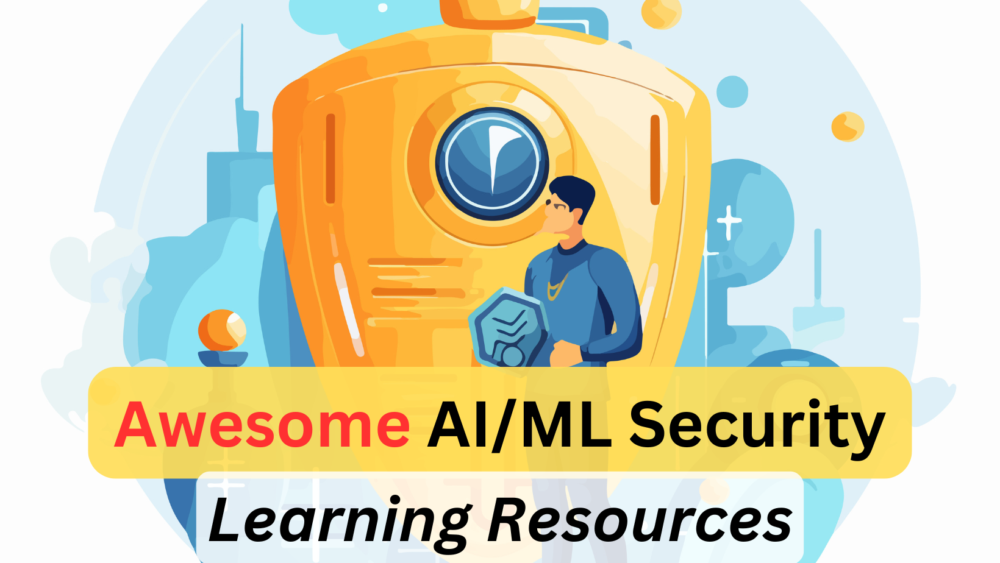

# Awesome AI/ML Security Learning Resources

AI/ML security is a fast-moving domain. It spans classical ML security (adversarial examples, model stealing, data poisoning), LLM-specific attacks (prompt injection, jailbreaks, training-data leakage, RAG/agent risks), MLOps supply-chain threats (model/artifact integrity, compromised pickles, malicious HuggingFace repos), and the governance side (EU AI Act, NIST AI RMF, ISO/IEC 42001).

## ToC
1. [Books](#books)
2. [Videos](#videos)
3. [Free/Paid Courses](#freepaid-courses)
4. [Free/Paid Labs](#freepaid-labs)
5. [Certifications](#aiml-security-certifications)
6. [Blogs/Articles](#blogsarticles)
7. [AI/ML Security Tools](#aiml-security-tools)
8. [Frameworks & Standards](#frameworks--standards)

## Books
1. [Adversarial AI Attacks, Mitigations, and Defense Strategies by John Sotiropoulos (Packt, 2024)](https://www.packtpub.com/en-us/product/adversarial-ai-attacks-mitigations-and-defense-strategies-9781835087985) - Practical overview of LLM and classical ML threats.
2. [Not with a Bug, But with a Sticker by Ram Shankar Siva Kumar, Hyrum Anderson (Wiley, 2023)](https://www.wiley.com/en-us/Not+with+a+Bug,+But+with+a+Sticker) - Highly recommended, accessible, industry-grounded.
3. [The Developer's Playbook for Large Language Model Security by Steve Wilson (O'Reilly, 2024)](https://www.oreilly.com/library/view/the-developers-playbook/9781098162184/)
4. [Generative AI Security by Ken Huang et al. (Springer, 2024)](https://link.springer.com/book/10.1007/978-3-031-54252-7)
5. [Practical Machine Learning for Computer Vision (O'Reilly)](https://www.oreilly.com/library/view/practical-machine-learning/9781098102357/) - Background reading.

## Videos
1. [Intro to LLM Security from WhyLabs](https://www.youtube.com/watch?v=dj1H4g4YSlU)
2. [Web LLM attacks - PortSwigger research](https://www.youtube.com/results?search_query=portswigger+llm)
3. [DEF CON AI Village talks](https://www.youtube.com/@aivillage)
4. [OWASP Top 10 for LLM Applications overview](https://www.youtube.com/results?search_query=owasp+top+10+llm)
5. [Simon Willison - Prompt injection explained](https://simonwillison.net/tags/promptinjection/) (blog with many talk videos)
6. [Lakera / HackAPrompt - adversarial prompt research](https://www.youtube.com/@lakera)

## Free/Paid Courses
1. [LLM CS-324 from Stanford University](https://stanford-cs324.github.io/winter2022/)
2. [COS 597G (Fall 2022) - Understanding Large Language Models, Princeton](https://www.cs.princeton.edu/courses/archive/fall22/cos597G/)
3. [Generative AI with LLMs - DeepLearning.AI + AWS on Coursera](https://www.coursera.org/learn/generative-ai-with-llms)
4. [IBM - Generative AI for Cybersecurity Professionals Specialization](https://www.coursera.org/specializations/generative-ai-for-cybersecurity-professionals)
5. [Johns Hopkins - AI for Cybersecurity Specialization](https://www.coursera.org/specializations/ai-for-cybersecurity)
6. [Generative AI Engineering with LLMs Specialization](https://www.coursera.org/specializations/generative-ai-engineering-with-llms)
7. [AttackIQ Academy - Foundations of AI Security (free)](https://www.academy.attackiq.com/courses/foundations-of-ai-security)
8. [Practical DevSecOps - Certified AI/ML Security Professional (CAISP)](https://www.practical-devsecops.com/certified-ai-ml-security-professional/)
9. [DeepLearning.AI - Red Teaming LLM Applications (short course, free)](https://www.deeplearning.ai/short-courses/red-teaming-llm-applications/)
10. [DeepLearning.AI - Quality and Safety for LLM Applications (free)](https://www.deeplearning.ai/short-courses/quality-safety-llm-applications/)

## Free/Paid Labs
1. [Gandalf by Lakera](https://gandalf.lakera.ai/) - Classic prompt-injection CTF.
2. [Prompt Airlines by Wiz](https://promptairlines.com/) - Prompt-injection challenges.
3. [Prompt Injection Playground - HackAPrompt](https://www.hackaprompt.com/)
4. [PortSwigger Web Security Academy - LLM attacks labs](https://portswigger.net/web-security/llm-attacks)
5. [Immersive Labs - AI/ML security modules](https://www.immersivelabs.com/)
6. [DeepLearning.AI LLM red-team notebooks (see short courses above)](https://www.deeplearning.ai/short-courses/)
7. [Damn Vulnerable LLM Agent by protectai](https://github.com/protectai/damn-vulnerable-llm-agent)
8. [huntr.com](https://huntr.com/) - World's first bug-bounty platform for AI/ML.

## AI/ML Security Certifications
1. [Certified AI/ML Pentester (AIMPT) by The SecOps Group](https://secops.group/product/certified-ai-ml-pentester/)
2. [CAISP - Certified AI Security Professional by Practical DevSecOps](https://www.practical-devsecops.com/certified-ai-security-professional/) - Hands-on course covering OWASP LLM Top 10, model attacks, AI supply chain risks, AI Threat Modeling, and MITRE ATLAS defenses.
3. [CMCPSE - Certified MCP Security Expert by Practical DevSecOps](https://www.practical-devsecops.com/certified-mcp-security-expert/) - Covers attacking, assessing, and hardening MCP servers. Topics include tool poisoning, prompt injection, supply chain security, and agentic AI defenses.
4. [Certified AI Security Fundamentals (various vendors: ISACA AAISM, ISC2 supplements)](https://www.isaca.org/credentialing) - Newer certs; check vendor availability.
5. [NVIDIA Deep Learning Institute - AI security modules](https://www.nvidia.com/en-us/training/)

## Blogs/Articles
### Core standards & reference
1. [OWASP Top 10 for LLM Applications](https://owasp.org/www-project-top-10-for-large-language-model-applications/)
2. [OWASP LLM AI Security and Governance Checklist](https://genai.owasp.org/resource/llm-ai-security-and-governance-checklist/)
3. [NIST AI Risk Management Framework (AI RMF 1.0)](https://www.nist.gov/itl/ai-risk-management-framework)
4. [NIST AI RMF Playbook](https://airc.nist.gov/AI_RMF_Knowledge_Base/Playbook)
5. [NIST AI 100-2e2025 - Adversarial Machine Learning Taxonomy](https://csrc.nist.gov/pubs/ai/100/2/e2025/final)
6. [NIST AI 600-1 - Generative AI Profile](https://nvlpubs.nist.gov/nistpubs/ai/NIST.AI.600-1.pdf)
7. [MITRE ATLAS - adversary tactics for AI systems](https://atlas.mitre.org/)
8. [Google's Secure AI Framework (SAIF)](https://safety.google/cybersecurity-advancements/saif/)
9. [Microsoft - Threat Modeling AI/ML Systems](https://learn.microsoft.com/en-us/security/engineering/threat-modeling-aiml)
10. [Microsoft AI Red Team: Lessons from red teaming 100 GenAI products](https://www.microsoft.com/en-us/security/blog/2025/01/13/3-takeaways-from-red-teaming-100-generative-ai-products/)
11. [Failure Modes in Machine Learning (Berryville Institute / Microsoft)](https://securityandtechnology.org/wp-content/uploads/2020/07/failure_modes_in_machine_learning.pdf)
12. [EU AI Act - full text and summaries](https://artificialintelligenceact.eu/)
13. [ISO/IEC 42001:2023 - AI Management System](https://www.iso.org/standard/81230.html)

### Prompt injection / jailbreaks / RAG
14. [Prompt injection explained - Simon Willison archive](https://simonwillison.net/tags/promptinjection/)
15. [Prompt injection jailbreaking of LLM apps](https://ogre51.medium.com/security-of-llm-apps-prompt-injection-jailbreaking-fb9fc5c883a8)
16. [Riding the RAG Trail by Lasso Security](https://www.lasso.security/blog/riding-the-rag-trail-access-permissions-and-context)
17. [Security Risks with RAG Architectures - IronCore Labs](https://ironcorelabs.com/security-risks-rag/)
18. [Mitigating Security Risks in RAG LLM Apps - CSA](https://cloudsecurityalliance.org/blog/2023/11/22/mitigating-security-risks-in-retrieval-augmented-generation-rag-llm-applications)
19. [RAG: The Essential Guide - Nightfall](https://www.nightfall.ai/ai-security-101/retrieval-augmented-generation-rag)
20. [Why RAG is revolutionising GenAI - Immuta](https://www.immuta.com/guides/data-security-101/retrieval-augmented-generation-rag/)
21. [PortSwigger - Web LLM attacks](https://portswigger.net/web-security/llm-attacks)
22. [LLM Security portal (curated)](https://llmsecurity.net/)

### Operational / defensive
23. [Security Incident Response using LLMs - Mercari engineering](https://engineering.mercari.com/en/blog/entry/20241206-streamlining-security-incident-response-with-automation-and-large-language-models/)
24. [Safeguarding LLMs with LLM-Guard](https://medium.com/@dataenthusiast.io/language-models-at-risk-safeguarding-ai-with-llm-guard-11a3e7923af5)
25. [LLM Guard Playground](https://huggingface.co/spaces/protectai/llm-guard-playground)
26. [Threat Modeling AI/ML assessments - plot4.ai](https://plot4.ai/assessments/quick-check)
27. [What are foundation models - DataCamp](https://www.datacamp.com/blog/what-are-foundation-models)
28. [Anthropic - Responsible Scaling Policy and red teaming posts](https://www.anthropic.com/research)
29. [OpenAI - System Cards and safety evaluations](https://openai.com/safety)

## AI/ML Security Tools
### Guardrails / prompt defenses
1. [LLM Guard by Protect AI](https://github.com/protectai/llm-guard) - Input/output sanitization, PII, jailbreak, toxicity.
2. [Rebuff by Protect AI](https://github.com/protectai/rebuff) - Prompt-injection detector.
3. [NVIDIA NeMo Guardrails](https://github.com/NVIDIA/NeMo-Guardrails) - Programmable guardrails for LLM apps.
4. [Guardrails AI](https://www.guardrailsai.com/) - Validators for LLM outputs.
5. [Lakera Guard](https://www.lakera.ai/) - Commercial guardrail + detection.

### Model / artifact scanning
6. [ModelScan by Protect AI](https://github.com/protectai/modelscan) - Scans PyTorch/TF/Keras/HF for malicious serialization.
7. [Picklescan by Hugging Face](https://github.com/mmaitre314/picklescan)
8. [Fickling](https://github.com/trailofbits/fickling) - Pickle decompiler and static analyzer by Trail of Bits.
9. [Vigil LLM](https://github.com/deadbits/vigil-llm) - LLM prompt-injection scanner.
10. [NB Defense by Protect AI](https://github.com/protectai/nbdefense) - Notebook security scanner.

### Red teaming / adversarial testing
11. [Microsoft PyRIT](https://github.com/Azure/PyRIT) - Python Risk Identification Toolkit for GenAI.
12. [Garak by NVIDIA](https://github.com/leondz/garak) - LLM vulnerability scanner.
13. [Promptfoo](https://github.com/promptfoo/promptfoo) - LLM eval + red-team framework.
14. [Giskard](https://github.com/Giskard-AI/giskard) - Open-source ML testing & red teaming.
15. [Adversarial Robustness Toolbox (ART) by IBM](https://github.com/Trusted-AI/adversarial-robustness-toolbox)
16. [CleverHans (Google)](https://github.com/cleverhans-lab/cleverhans) - Adversarial examples library (maintained-but-older).
17. [Foolbox](https://github.com/bethgelab/foolbox)
18. [TextAttack](https://github.com/QData/TextAttack) - NLP adversarial attacks.
19. [AI-exploits by Protect AI](https://github.com/protectai/ai-exploits) - Real-world AI/ML exploit repo.

### MLOps / supply chain
20. [HiddenLayer](https://hiddenlayer.com/) - Commercial ML detection/response.
21. [Protect AI Platform](https://protectai.com/) - Overall AI security suite.
22. [Robust Intelligence (now Cisco)](https://www.robustintelligence.com/)

### Observability / evaluation
23. [WhyLabs LangKit](https://github.com/whylabs/langkit) - LLM metrics for telemetry.
24. [Arize AI Phoenix](https://github.com/Arize-ai/phoenix) - Observability for LLM/RAG/agents.
25. [Langfuse](https://github.com/langfuse/langfuse) - Open-source LLM observability.

## Frameworks & Standards
1. [OWASP Top 10 for LLMs (genai.owasp.org)](https://genai.owasp.org/)
2. [OWASP ML Security Top 10](https://owasp.org/www-project-machine-learning-security-top-10/)
3. [MITRE ATLAS](https://atlas.mitre.org/)
4. [NIST AI RMF 1.0 + GenAI Profile](https://www.nist.gov/itl/ai-risk-management-framework)
5. [Google SAIF](https://safety.google/cybersecurity-advancements/saif/)
6. [ISO/IEC 42001:2023 - AI Management System](https://www.iso.org/standard/81230.html)
7. [EU AI Act](https://artificialintelligenceact.eu/)
8. [CSA AI Controls Matrix](https://cloudsecurityalliance.org/research/working-groups/ai-technology-risk-management)
9. [Databricks AI Security Framework (DASF)](https://www.databricks.com/resources/whitepaper/databricks-ai-security-framework-dasf)
