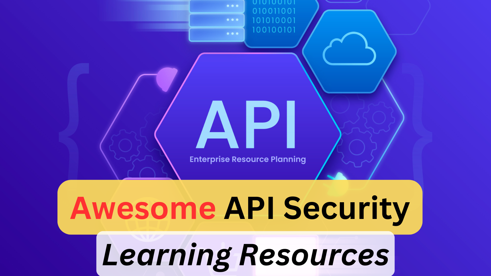

# Awesome API Security Learning Resources

API security is one of the fastest-growing domains inside AppSec. Modern applications expose far more attack surface via REST, GraphQL, gRPC and webhook APIs than through traditional web UIs, and the OWASP API Security Top 10 (2023) reflects an industry shift toward authorization, business-logic and resource-consumption flaws.

## ToC
1. [Books](#books)
2. [Videos](#videos)
3. [Free/Paid Courses](#freepaid-courses)
4. [Free/Paid Labs](#freepaid-labs)
5. [API Security Tools](#api-security-tools)
6. [Certifications](#certifications)
7. [Blogs/Articles](#blogsarticles)

## Books
1. [Hacking APIs by Corey J. Ball](https://nostarch.com/hacking-apis) — Hands-on guide to breaking web APIs, widely regarded as the best starter book for API pentesters.
2. [API Security in Action by Neil Madden](https://www.manning.com/books/api-security-in-action) — Defensive, developer-focused guide covering OAuth2, JWT, mTLS, API gateways and rate limiting.
3. [Advanced API Security: OAuth 2.0 and Beyond by Prabath Siriwardena](https://link.springer.com/book/10.1007/978-1-4842-2050-4) — Deep dive into OAuth 2.0, OpenID Connect, SCIM and enterprise identity federation for APIs.
4. [Designing Web APIs by Brenda Jin, Saurabh Sahni, Amir Shevat](https://www.oreilly.com/library/view/designing-web-apis/9781492026914/) — Not purely security, but essential for threat-modeling API designs.
5. [The OWASP API Security Top 10 (2023) – free](https://owasp.org/API-Security/editions/2023/en/0x00-header/) — Baseline reading for anyone doing API security.

## Videos
1. [OWASP API Security Top 10 2023 – Official walkthrough](https://www.youtube.com/watch?v=QPEAu3HvGrQ)
2. [API Security – Corey Ball at OWASP Global AppSec](https://www.youtube.com/watch?v=qqmyAxfGV9c)
3. [Hacking APIs: Fun and Profit – DEF CON talks playlist](https://www.youtube.com/results?search_query=defcon+api+hacking)
4. [GraphQL Security – PortSwigger Research](https://www.youtube.com/watch?v=NPDp7GHmMa0)
5. [Attacking and Defending GraphQL APIs – Black Hat](https://www.youtube.com/results?search_query=black+hat+graphql+security)
6. [JWT attacks explained – PwnFunction](https://www.youtube.com/watch?v=3OpQi65tr4o)

## Free/Paid Courses
1. [APIsec University (Free)](https://university.apisec.ai/) — Full curriculum including "API Security Fundamentals", "API Penetration Testing" and "OWASP API Top 10". Highly recommended free resource.
2. [PortSwigger Web Security Academy – API testing labs](https://portswigger.net/web-security/api-testing) — Free hands-on labs including GraphQL, mass assignment and server-side parameter pollution.
3. [Hacking APIs by Corey Ball – TCM Security course](https://academy.tcm-sec.com/p/hacking-apis) — Companion video course to the book.
4. [SANS SEC552: Bug Bounties and Responsible Disclosure](https://www.sans.org/cyber-security-courses/bug-bounties-responsible-disclosure/) — Paid, covers API-heavy targets.
5. [OWASP API Security Top 10 on Pluralsight / LinkedIn Learning](https://www.linkedin.com/learning/search?keywords=API%20security) — Various paid options.

## Free/Paid Labs
1. [crAPI (Completely Ridiculous API) by OWASP](https://github.com/OWASP/crAPI) — Intentionally vulnerable API covering the full OWASP API Top 10.
2. [VAmPI – Vulnerable REST API](https://github.com/erev0s/VAmPI) — Flask-based intentionally vulnerable API with two modes (vulnerable/secure).
3. [DVGA – Damn Vulnerable GraphQL Application](https://github.com/dolevf/Damn-Vulnerable-GraphQL-Application) — Essential for learning GraphQL-specific attacks.
4. [APIsec University Labs](https://university.apisec.ai/) — Free hosted labs tied to the free courses.
5. [PortSwigger API labs](https://portswigger.net/web-security/all-labs#api-testing) — Free, browser-based, no setup.
6. [HackTheBox – Intro to API Pentesting module](https://academy.hackthebox.com/module/details/230) — Paid academy path.
7. [vAPI – Vulnerable Adversely Programmed Interface](https://github.com/roottusk/vapi) — Self-hosted API lab mapped to OWASP API Top 10 2019.

## API Security Tools
### Discovery & Inventory
1. [Kiterunner](https://github.com/assetnote/kiterunner) — Content discovery tool specifically built for APIs (replaces generic dir busters for API endpoints).
2. [Akto](https://github.com/akto-api-security/akto) — Open-source API discovery and security testing platform.
3. [Postman](https://www.postman.com/) — Still the most used tool for API exploration and scripted testing.

### Offensive / Testing
4. [OWASP ZAP – OpenAPI / GraphQL add-ons](https://www.zaproxy.org/) — Free, scriptable API scanner.
5. [Burp Suite with API extensions](https://portswigger.net/burp) — Paired with `JWT Editor`, `GraphQL Raider`, `Autorize`, `InQL`, and `Param Miner`.
6. [InQL](https://github.com/doyensec/inql) — Burp extension for GraphQL introspection and testing.
7. [Autorize](https://github.com/Quitten/Autorize) — Burp extension to detect BOLA/BFLA (broken object/function-level authorization).
8. [Schemathesis](https://github.com/schemathesis/schemathesis) — Property-based fuzzing of OpenAPI/GraphQL schemas.
9. [RESTler by Microsoft](https://github.com/microsoft/restler-fuzzer) — Stateful REST API fuzzer.
10. [APIsec](https://www.apisec.ai/) — Commercial continuous API testing platform.

### Defensive / Runtime
11. [Salt Security](https://salt.security/), [Noname Security (now Akamai)](https://nonamesecurity.com/), [Traceable AI](https://www.traceable.ai/), [42Crunch](https://42crunch.com/) — Commercial API security platforms (discovery, posture, runtime protection).
12. [Levo.ai](https://www.levo.ai/) — OpenAPI-driven testing and runtime monitoring.
13. [Open Policy Agent (OPA)](https://www.openpolicyagent.org/) — Fine-grained authorization for APIs/microservices.
14. [Envoy / Istio / Kong Gateway](https://konghq.com/) — API gateways with WAF, rate limiting and mTLS capabilities.

## Certifications
1. [CASA – Certified API Security Analyst (The SecOps Group)](https://secops.group/product/certified-api-security-analyst/) — Offensive, practical.
2. [APIsec University – Certified API Security Specialist (free)](https://university.apisec.ai/) — Free certification of completion, good starting badge.
3. [42Crunch API Security Certified Professional](https://42crunch.com/) — Defensive, API-gateway oriented.
4. [CASP - Certified API Security Professional (Practical DevSecOps)](https://www.practical-devsecops.com/certified-api-security-professional/) — Teaches how to secure and audit APIs against vulnerabilities.
5. [OSWE by Offensive Security](https://www.offsec.com/courses/web-300/) — Not API-specific but covers advanced web/API exploitation.

## Blogs/Articles
1. [OWASP API Security Top 10 (2023) – official site](https://owasp.org/API-Security/editions/2023/en/0x00-header/)
2. [OWASP API Top 10 explained – Salt Security](https://salt.security/blog/owasp-api-security-top-10-explained)
3. [Free resources to practice for OWASP Top 10 API](https://application.security/free/owasp-top-10-API)
4. [API Security checklist by Shieldfy](https://github.com/shieldfy/API-Security-Checklist) — Classic, widely-referenced checklist (note: last updated a few years ago, still mostly valid).
5. [APISecurity.io newsletter and articles](https://apisecurity.io/) by 42Crunch — Weekly API security digest.
6. [Inon Shkedy – 31 days of API security tips](https://github.com/inonshk/31-days-of-API-Security-Tips)
7. [GraphQL Security Best Practices – Apollo](https://www.apollographql.com/blog/graphql-security-best-practices)
8. [PortSwigger Research – Web cache deception and API attacks](https://portswigger.net/research)
9. [NIST SP 800-204 series (microservices & API security)](https://csrc.nist.gov/publications/detail/sp/800-204/final)
10. [JWT best current practices (RFC 8725)](https://datatracker.ietf.org/doc/html/rfc8725)
11. [BOLA – why it is the #1 API vulnerability](https://apisecurity.io/issue-176-how-to-find-and-fix-bola-vulnerabilities/)
12. [Bug bounty API write-ups – Pentester Land list](https://pentester.land/writeups/)