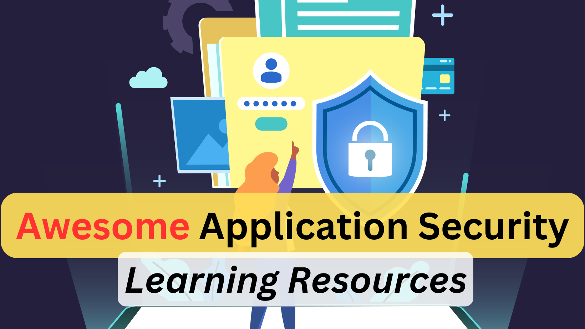

# Awesome Application Security Learning Resources

AppSec is all about protecting your application from the adversaries such as SAST, SCA, Secure Code Review, Security Architecture etc.
Attacking an app can fall under [web or app pentest](awesome-pentest-learning-resources.md)

## ToC
1. [Books](#books)
2. [Videos](#videos)
3. [Free/Paid Courses](#freepaid-courses)
4. [Free/Paid Labs](#freepaid-labs)
5. [Security Tools](#security-tools)
6. [Certifications](#certifications)
7. [Blogs/Articles](#blogsarticles)

## Books
1. [Agile Application Security - Highly Recommended](https://amzn.to/3YKVjxr)
2. The Web Application Hacker's Handbook
3. [Threat Modeling: Designing for Security](https://amzn.to/4fKtZX9) or
4. [Threat Modeling: A practical guide for development teams](https://amzn.to/3YLHwXh)
5. [The Tangled Web](https://amzn.to/48Sobso)
6. [Web Security for Developers: Real Threats, Practical Defense](https://amzn.to/3UHkMqb)
7. [Web Application Security: Exploitation and Countermeasures for Modern Web Applications](https://amzn.to/4eyv9Ec)
8. [Application Security Program Handbook: A Guide for Software Engineers and Team Leaders](https://amzn.to/3AOBbCu)
9. [Enterprise Security Architect](https://amzn.to/4hUxlZw)

## Videos
1. [Youtube video on semgrep’s taint mode](https://www.youtube.com/watch?v=6MxMhFPkZlU)

## Free/Paid Courses
1. [PortSwigger Web Security Academy](https://portswigger.net/web-security)

## Free/Paid Labs
1. https://application.security/ Try its free gamified challenges on API, Web, Cloud, front-end.
2. Secure Code Warrior
3. HackEDU
4. OWASP Juice Shop
5. Pentester Lab 
6. Github Security Lab 
7. Google Gruyere
8. Django.nv
9. DVWA

## Security tools
It will include tools for SAST, SCA, OAST, Threat Modeling, Secure Code Review, secrets management etc
### SAST
**Open source**
1. Sonarqube
2. Bandit
3. Brakeman
4. FindSecBugs
5. Semgrep
6. CodeQL

**Paid**
7. Checkmarx
8. Veracode
9. Snyk
10. Coverity

### SCA
1. OWASP Dependency Check
2. Retire.js
3. CycloneDX
4. Snyk
5. CheckMarx CxSCA
6. JFrog XRay

### Secrets
1. GitLeaks
2. TruffleHog
3. Talisman
4. Shhgit
5. Repo-supervisor
6. Hashicorp Vault
7. Cyberark Conjur

### Threat Modeling
1. [OWASP ThreatDragon](https://www.threatdragon.com/#/)
2. SDElements
3. IriusRisk
4. [Threagile](https://run.threagile.io/)
5. ThreatModeler
6. [Microsoft Threat Modeling tool](https://learn.microsoft.com/en-us/azure/security/develop/threat-modeling-tool)
7. [STRIDE GPT](https://stridegpt.streamlit.app/)
8. ThreatSpec
9. PyTM

## Certifications
1. [CISSP - Certified Information Systems Security Professional](https://www.isc2.org/certifications/cissp)
2. [CSSLP Certified Secure Software Lifecycle Professional](https://www.isc2.org/certifications/csslp)
3. [ISSAP – Information Systems Security Architecture Professional](https://www.isc2.org/certifications/issap)
4. CASE (Certified Application Security Engineer) Java or CASE .Net
5. [CompTIA CASP+ (Application Security Professionals Plus)](https://www.comptia.org/certifications/comptia-advanced-security-practitioner)

## Blogs/Articles
1. [Scaling your AppSec Program with semgrep](https://www.youtube.com/watch?v=rAwxFw25x3E)
2. [TOP 10 THINGS TO KNOW ABOUT SECURITY AS A SOFTWARE ARCHITECT](https://vedcraft.com/architecture/top-10-things-to-know-about-security-as-a-software-architect/)
3. [System Design for Security](https://rethinksecurity.io/posts/system-design-for-security/)
4. [Top 25 software security errors](https://www.sans.org/top25-software-errors/)
5. [Security prioritization](https://boringappsec.substack.com/p/edition-19-securitys-eternal-prioritisation)
6. [CWE top 25 2023 list](https://cwe.mitre.org/top25/archive/2023/2023_top25_list.html#top25list)
7. [Open Policy Agent (OPA) documentation](https://www.openpolicyagent.org/docs/latest/)
8. [semgrep documentation](https://semgrep.dev/docs/)
9. [MITRE ATT&CK and Defender (MAD) Program](https://mad.mitre-engenuity.org/)
10. [A dive into web application authentication](https://betterappsec.com/a-medium-dive-into-web-application-authentication-342d1d002a61)
11. [Taint Analysis or Taint Checking](https://en.wikipedia.org/wiki/Taint_checking)
12. [log4j vulnerability walkthrough](https://www.apiscene.io/api-security-identity/log4j-2-vulnerabilities-a-walkthrough/) 
13. [Zero day exploitation of confluence](https://www.volexity.com/blog/2022/06/02/zero-day-exploitation-of-atlassian-confluence/)
14. [Cryptography Module in Python](https://www.dlitz.net/software/pycrypto/doc/)
15. [Secure Coding with Python](https://devopedia.org/secure-coding-with-python)
16. [Security concerns in modules and function - github owasp](https://github.com/ebranca/owasp-pysec/wiki/Security-Concerns-in-modules-and-functions)
17. [Hacking Python Application](https://medium.com/swlh/hacking-python-applications-5d4cd541b3f1)
18. [Secure Design Principles](https://cydrill.com/cyber-security/secure-design-principles/ )