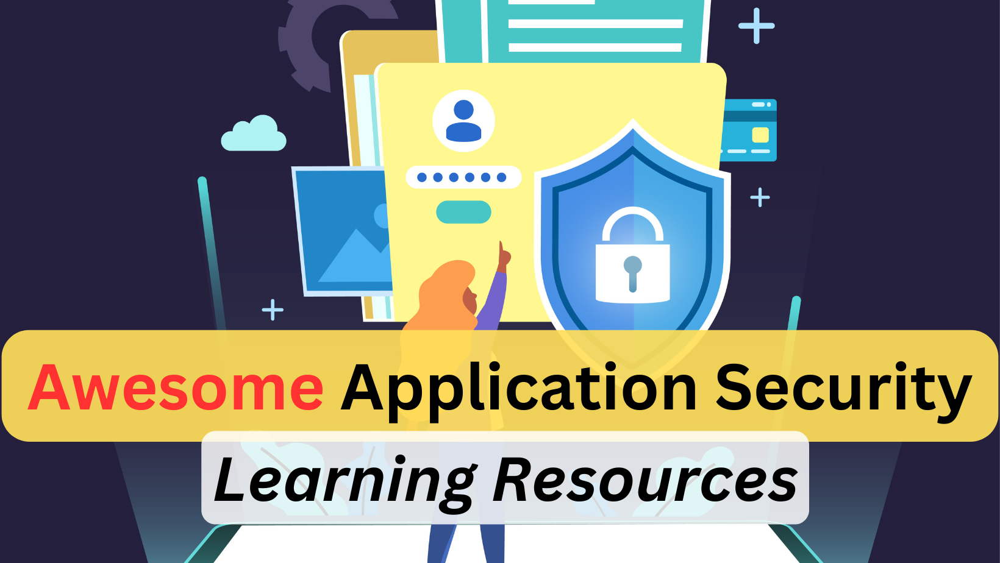

# Awesome Application Security Learning Resources

AppSec is all about protecting your application from the adversaries such as SAST, SCA, Secure Code Review, Security Architecture etc.
Attacking an app can fall under [web or app pentest](awesome-pentest-learning-resources.md)

## ToC
1. [Books](#books)
2. [Videos](#videos)
3. [Free/Paid Courses](#freepaid-courses)
4. [Free/Paid Labs](#freepaid-labs)
5. [Security Tools](#security-tools)
6. [Certifications](#certifications)
7. [Blogs/Articles](#blogsarticles)

## Books
1. [Agile Application Security - Highly Recommended](https://amzn.to/3YKVjxr)
2. The Web Application Hacker's Handbook
3. [Threat Modeling: Designing for Security](https://amzn.to/4fKtZX9) or
4. [Threat Modeling: A practical guide for development teams](https://amzn.to/3YLHwXh)
5. [The Tangled Web](https://amzn.to/48Sobso)
6. [Web Security for Developers: Real Threats, Practical Defense](https://amzn.to/3UHkMqb)
7. [Web Application Security: Exploitation and Countermeasures for Modern Web Applications](https://amzn.to/4eyv9Ec)
8. [Application Security Program Handbook: A Guide for Software Engineers and Team Leaders](https://amzn.to/3AOBbCu)
9. [Enterprise Security Architect](https://amzn.to/4hUxlZw)

## Videos
1. [Youtube video on semgrep's taint mode](https://www.youtube.com/watch?v=6MxMhFPkZlU)
2. [OWASP Global AppSec conference talks](https://www.youtube.com/@owasp)
3. [LocoMoco Security Conf - AppSec deep dives](https://www.youtube.com/@locomocosec)
4. [Clint Gibler (tl;dr sec) talks on scaling AppSec](https://www.youtube.com/results?search_query=clint+gibler+appsec)
5. [LiveOverflow - deep web/binary exploitation](https://www.youtube.com/@LiveOverflow)
6. [PwnFunction - web vuln concepts](https://www.youtube.com/@PwnFunction)
7. [IppSec - HackTheBox walkthroughs](https://www.youtube.com/@ippsec)

## Free/Paid Courses
1. [PortSwigger Web Security Academy (free)](https://portswigger.net/web-security)
2. [OWASP Juice Shop Companion Guide (free)](https://pwning.owasp-juice.shop/)
3. [SANS SEC540: Cloud Security and DevSecOps Automation](https://www.sans.org/cyber-security-courses/cloud-security-devsecops-automation/)
4. [SANS SEC522: Defending Web Applications Security Essentials](https://www.sans.org/cyber-security-courses/defending-web-applications-security-essentials/)
5. [SANS SEC540 / SEC542 / SEC642](https://www.sans.org/cyber-security-courses/?focus-area=offensive-operations)
6. [Practical DevSecOps - Certified Application Security Practitioner](https://www.practical-devsecops.com/)
7. [AppSec Engineer by We Hack Purple / Tanya Janca](https://community.wehackpurple.com/)
8. [Pentester Academy - AppSec paths](https://www.pentesteracademy.com/)
9. [Coursera - Software Security (University of Maryland)](https://www.coursera.org/learn/software-security)

## Free/Paid Labs
1. [application.security](https://application.security/) - free gamified challenges on API, Web, Cloud, front-end.
2. [Secure Code Warrior](https://www.securecodewarrior.com/) - Commercial developer training.
3. [Security Journey (formerly HackEDU)](https://www.securityjourney.com/)
4. [OWASP Juice Shop](https://owasp.org/www-project-juice-shop/) - Most popular intentionally vulnerable web app.
5. [PentesterLab](https://pentesterlab.com/) - Hands-on exercises.
6. [GitHub Security Lab CTF](https://securitylab.github.com/ctf/)
7. [Google Gruyere](https://google-gruyere.appspot.com/)
8. [Django.nv](https://github.com/nVisium/django.nv)
9. [DVWA - Damn Vulnerable Web App](https://github.com/digininja/DVWA)
10. [WebGoat](https://owasp.org/www-project-webgoat/) - OWASP's legacy but still useful Java learning app.
11. [OWASP Security Shepherd](https://owasp.org/www-project-security-shepherd/)
12. [HackMyVM](https://hackmyvm.eu/) - Free boot2root style VMs.
13. [Root-Me](https://www.root-me.org/) - Large CTF-style challenges repository.
14. [Vulnerable Web Applications Directory by OWASP](https://owasp.org/www-project-vulnerable-web-applications-directory/)

## Security tools
It will include tools for SAST, SCA, OAST, Threat Modeling, Secure Code Review, secrets management etc
### SAST
**Open source**
1. [SonarQube](https://www.sonarsource.com/products/sonarqube/)
2. [Bandit](https://github.com/PyCQA/bandit) (Python)
3. [Brakeman](https://brakemanscanner.org/) (Ruby on Rails)
4. [FindSecBugs / SpotBugs](https://find-sec-bugs.github.io/) (Java)
5. [Semgrep](https://semgrep.dev/) (multi-language, customizable rules)
6. [CodeQL](https://codeql.github.com/) (semantic, free for OSS)
7. [gosec](https://github.com/securego/gosec) (Go)
8. [njsscan](https://github.com/ajinabraham/njsscan) (Node.js)

**Paid**
9. [Checkmarx One](https://checkmarx.com/)
10. [Veracode](https://www.veracode.com/)
11. [Snyk Code](https://snyk.io/product/snyk-code/)
12. [Coverity (Black Duck)](https://www.blackduck.com/)
13. [Fortify by OpenText](https://www.opentext.com/products/fortify-static-code-analyzer)

### SCA
1. [OWASP Dependency-Check](https://owasp.org/www-project-dependency-check/)
2. [OWASP Dependency-Track](https://dependencytrack.org/) - SBOM-centric continuous monitoring.
3. [Retire.js](https://retirejs.github.io/retire.js/)
4. [CycloneDX CLI](https://github.com/CycloneDX/cyclonedx-cli) - SBOM generation/manipulation.
5. [Syft](https://github.com/anchore/syft) - SBOM generator.
6. [Trivy](https://github.com/aquasecurity/trivy) - Scans dependencies across many ecosystems.
7. [Snyk Open Source](https://snyk.io/product/open-source-security-management/)
8. [Checkmarx SCA](https://checkmarx.com/cxsca-open-source-scanning/)
9. [JFrog Xray](https://jfrog.com/xray/)
10. [Socket.dev](https://socket.dev/) - Supply-chain / malicious package detection for npm, PyPI.

### Secrets
1. [gitleaks](https://github.com/gitleaks/gitleaks)
2. [TruffleHog](https://github.com/trufflesecurity/trufflehog)
3. [Talisman](https://github.com/thoughtworks/talisman)
4. [detect-secrets (Yelp)](https://github.com/Yelp/detect-secrets)
5. [git-secrets (AWS)](https://github.com/awslabs/git-secrets)
6. [Repo-supervisor](https://github.com/auth0/repo-supervisor) - (maintenance mode)
7. [HashiCorp Vault](https://www.vaultproject.io/)
8. [CyberArk Conjur](https://www.conjur.org/)
9. [GitGuardian](https://www.gitguardian.com/) - commercial scanning.

### Threat Modeling
1. [OWASP ThreatDragon](https://www.threatdragon.com/#/)
2. SDElements
3. IriusRisk
4. [Threagile](https://run.threagile.io/)
5. ThreatModeler
6. [Microsoft Threat Modeling tool](https://learn.microsoft.com/en-us/azure/security/develop/threat-modeling-tool)
7. [STRIDE GPT](https://stridegpt.streamlit.app/)
8. ThreatSpec
9. PyTM

## Certifications
1. [CISSP - Certified Information Systems Security Professional](https://www.isc2.org/certifications/cissp)
2. [CSSLP Certified Secure Software Lifecycle Professional](https://www.isc2.org/certifications/csslp)
3. [ISSAP – Information Systems Security Architecture Professional](https://www.isc2.org/certifications/issap)
4. CASE (Certified Application Security Engineer) Java or CASE .Net
5. [CompTIA CASP+ (Application Security Professionals Plus)](https://www.comptia.org/certifications/comptia-advanced-security-practitioner)
6. [CTMP - Certified Threat Modeling Professional (Practical DevSecOps)](https://www.practical-devsecops.com/certified-threat-modeling-professional/) — Covers STRIDE, PASTA, DREAD, MITRE, Agile, and Privacy threat modeling methods.

## Blogs/Articles
1. [Scaling your AppSec Program with semgrep](https://www.youtube.com/watch?v=rAwxFw25x3E)
2. [TOP 10 THINGS TO KNOW ABOUT SECURITY AS A SOFTWARE ARCHITECT](https://vedcraft.com/architecture/top-10-things-to-know-about-security-as-a-software-architect/)
3. [System Design for Security](https://rethinksecurity.io/posts/system-design-for-security/)
4. [Top 25 software security errors](https://www.sans.org/top25-software-errors/)
5. [Security prioritization](https://boringappsec.substack.com/p/edition-19-securitys-eternal-prioritisation)
6. [CWE top 25 2023 list](https://cwe.mitre.org/top25/archive/2023/2023_top25_list.html#top25list)
7. [Open Policy Agent (OPA) documentation](https://www.openpolicyagent.org/docs/latest/)
8. [semgrep documentation](https://semgrep.dev/docs/)
9. [MITRE ATT&CK and Defender (MAD) Program](https://mad.mitre-engenuity.org/)
10. [A dive into web application authentication](https://betterappsec.com/a-medium-dive-into-web-application-authentication-342d1d002a61)
11. [Taint Analysis or Taint Checking](https://en.wikipedia.org/wiki/Taint_checking)
12. [log4j vulnerability walkthrough](https://www.apiscene.io/api-security-identity/log4j-2-vulnerabilities-a-walkthrough/) 
13. [Zero day exploitation of confluence](https://www.volexity.com/blog/2022/06/02/zero-day-exploitation-of-atlassian-confluence/)
14. [Python cryptography library (pyca/cryptography) - use this instead of the deprecated PyCrypto](https://cryptography.io/)
15. [Secure Coding with Python](https://devopedia.org/secure-coding-with-python)
16. [OWASP Python Security Project (archived but still referenced)](https://github.com/ebranca/owasp-pysec)
17. [Hacking Python Application](https://medium.com/swlh/hacking-python-applications-5d4cd541b3f1)
18. [Secure Design Principles](https://cydrill.com/cyber-security/secure-design-principles/)
19. [OWASP ASVS (Application Security Verification Standard)](https://owasp.org/www-project-application-security-verification-standard/)
20. [OWASP SAMM (Software Assurance Maturity Model)](https://owaspsamm.org/)
21. [OWASP Cheat Sheet Series](https://cheatsheetseries.owasp.org/)
22. [OWASP Proactive Controls](https://owasp.org/www-project-proactive-controls/)
23. [tl;dr sec newsletter by Clint Gibler](https://tldrsec.com/)
24. [We Hack Purple AppSec Podcast](https://community.wehackpurple.com/)
25. [CWE Top 25 Most Dangerous Software Weaknesses (latest)](https://cwe.mitre.org/top25/)