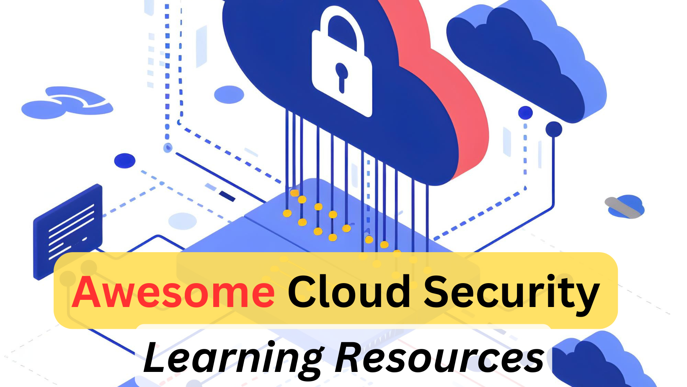

# Awesome Cloud Security Learning Resources

Cloud security spans IAM, network security, workload security, data security, posture management (CSPM), workload protection (CWPP), and the emerging CNAPP category. This list is multi-cloud (AWS, Azure, GCP) but leans pragmatic - what actually gets asked on the job.

> See also the companion repo: [Awesome AWS Security](https://github.com/jassics/awesome-aws-security)

## ToC
1. [Books](#books)
2. [Videos](#videos)
3. [Free/Paid Courses](#freepaid-courses)
4. [Free/Paid Labs](#freepaid-labs)
5. [Security Tools](#security-tools)
6. [Certifications](#certifications)
7. [Blogs/Articles](#blogsarticles)

## Books
1. [AWS Security by Dylan Shields (Manning)](https://www.manning.com/books/aws-security) - Hands-on, current, covers IAM, VPC, KMS, GuardDuty, Security Hub.
2. [Hands-On AWS Penetration Testing with Kali Linux by Karl Gilbert, Benjamin Caudill](https://www.packtpub.com/product/hands-on-aws-penetration-testing-with-kali-linux/9781789136722) - Solid intro to offensive AWS.
3. [Practical Cloud Security by Chris Dotson (O'Reilly)](https://www.oreilly.com/library/view/practical-cloud-security/9781492037507/) - Cloud-agnostic, very accessible. A 2nd edition was released in 2023.
4. [Microsoft Azure Security Infrastructure by Yuri Diogenes](https://www.microsoftpressstore.com/store/microsoft-azure-security-infrastructure-9781509304158) - For Azure-focused readers.
5. [Google Cloud Certified Professional Cloud Security Engineer Study Guide (Sybex)](https://www.wiley.com/en-us/Google+Cloud+Certified+Professional+Cloud+Security+Engineer+Study+Guide-p-9781394261499) - Good structured GCP-security intro.
6. [Cloud Security Handbook by Eyal Estrin (Packt)](https://www.packtpub.com/product/cloud-security-handbook/9781800569188) - Multi-cloud, defender-oriented.
7. [CSA Cloud Controls Matrix (CCM) v4 - free](https://cloudsecurityalliance.org/research/cloud-controls-matrix/) - De-facto control framework across clouds.
8. [CNCF Cloud Native Security Whitepaper v2 (free)](https://github.com/cncf/tag-security/blob/main/security-whitepaper/v2/CNCF_cloud-native-security-whitepaper-May2022-v2.pdf)

## Videos
1. [AWS re:Inforce sessions (YouTube)](https://www.youtube.com/@AWSEventsChannel/search?query=reInforce) - Annual AWS security conference.
2. [fwd:cloudsec conference talks](https://www.youtube.com/@fwdcloudsec) - Arguably the best practitioner-led cloud security conference.
3. [Cloud Security Podcast by Ashish Rajan](https://www.youtube.com/@CloudSecurityPodcast)
4. [SANS Cloud Security webcasts](https://www.sans.org/webcasts/?focus-area=cloud-security)
5. [John Savill's Technical Training - Azure Security](https://www.youtube.com/@NTFAQGuy)
6. [Google Cloud Security Talks](https://cloudonair.withgoogle.com/events/security-talks)

## Free/Paid Courses
### AWS
1. [AWS Skill Builder - Security Learning Plan (Free)](https://explore.skillbuilder.aws/learn/public/learning_plan/view/83/security-learning-plan)
2. [AWS Security Fundamentals (Free, self-paced)](https://aws.amazon.com/training/classroom/aws-security-fundamentals/)
3. [SANS SEC488: Cloud Security Essentials](https://www.sans.org/cyber-security-courses/cloud-security-essentials/)
4. [SANS SEC510: Public Cloud Security: AWS, Azure, and GCP](https://www.sans.org/cyber-security-courses/public-cloud-security-aws-azure-gcp/)
5. [SANS SEC540: Cloud Security and DevSecOps Automation](https://www.sans.org/cyber-security-courses/cloud-security-devsecops-automation/)
6. [AttackIQ Academy - Cloud security courses (Free)](https://www.academy.attackiq.com/)

### Azure
7. [Microsoft Learn - AZ-500 learning path (Free)](https://learn.microsoft.com/en-us/training/courses/az-500t00)
8. [Microsoft Learn - SC-100 Cybersecurity Architect](https://learn.microsoft.com/en-us/training/courses/sc-100t00)

### GCP
9. [Google Cloud Skills Boost - Security Engineer Learning Path](https://www.cloudskillsboost.google/paths/12)
10. [Coursera - Google Cloud Security Professional Certificate](https://www.coursera.org/professional-certificates/google-cloud-security)

### Multi-cloud / Vendor-neutral
11. [Cloud Security Alliance - CCSK training](https://cloudsecurityalliance.org/education/ccsk/)
12. [Practical DevSecOps - Certified Cloud Security Engineer (CCSE)](https://www.practical-devsecops.com/certified-cloud-security-engineer/)
13. [Antisyphon - Breaching the Cloud (Beau Bullock)](https://www.antisyphontraining.com/course/breaching-the-cloud-with-beau-bullock/)
14. [HackTheBox Academy - Cloud Security paths](https://academy.hackthebox.com/)

## Free/Paid Labs
### AWS
1. [flaws.cloud](https://flaws.cloud/) by Scott Piper - the classic AWS CTF.
2. [flaws2.cloud](https://flaws2.cloud/) - attacker and defender tracks.
3. [CloudGoat by Rhino Security Labs](https://github.com/RhinoSecurityLabs/cloudgoat) - AWS vulnerable-by-design scenarios, Terraform-deployable.
4. [AWSGoat by INE Labs](https://github.com/ine-labs/AWSGoat) - multi-scenario AWS pentest lab.
5. [Sadcloud](https://github.com/nccgroup/sadcloud) - Terraform to spin up misconfigured AWS resources.
6. [AWS Jam](https://jam.awsevents.com/) - gamified official AWS challenges.
7. [IAM Vulnerable](https://github.com/BishopFox/iam-vulnerable) by Bishop Fox - AWS IAM privilege escalation lab.

### Azure
8. [AzureGoat by INE Labs](https://github.com/ine-labs/AzureGoat) - vulnerable Azure environment.
9. [PurpleCloud by Jason Ostrom](https://github.com/iknowjason/PurpleCloud) - Azure AD / hybrid attack lab.
10. [XMGoat](https://github.com/XMCyber/XMGoat) - Azure misconfiguration CTF.
11. [BadZure](https://github.com/mvelazc0/BadZure) - PowerShell script to spin up a misconfigured Entra ID tenant.

### GCP
12. [GCPGoat by INE Labs](https://github.com/ine-labs/GCPGoat)
13. [ThunderCTF](https://thunder-ctf.cloud/) - GCP CTF by Michael Ikemann.

### Multi-cloud
14. [HackTricks Cloud - AWS, Azure, GCP, K8s cheatsheet](https://cloud.hacktricks.xyz/)
15. [Pentester Academy - AttackDefense cloud labs](https://attackdefense.com/)
16. [TryHackMe - Cloud Security path](https://tryhackme.com/path/outline/cloud)

## Security Tools
### Multi-cloud CSPM / CNAPP (OSS)
1. [Prowler](https://github.com/prowler-cloud/prowler) - AWS, Azure, GCP, Kubernetes CSPM; 400+ checks.
2. [ScoutSuite by NCC Group](https://github.com/nccgroup/ScoutSuite) - multi-cloud security auditing.
3. [Cloudsplaining by Salesforce](https://github.com/salesforce/cloudsplaining) - AWS IAM least-privilege assessment.
4. [Steampipe](https://steampipe.io/) - query cloud configs with SQL.
5. [CloudQuery](https://www.cloudquery.io/) - cloud asset inventory as code.
6. [Cartography by Lyft](https://github.com/cartography-cncf/cartography) - graph-based infra asset inventory (now a CNCF sandbox project).

### AWS-specific
7. [Pacu by Rhino Security](https://github.com/RhinoSecurityLabs/pacu) - offensive AWS exploitation framework.
8. [aws-nuke](https://github.com/rebuy-de/aws-nuke) - clean up AWS accounts (use with care).
9. [Parliament](https://github.com/duo-labs/parliament) - IAM policy linter by Duo Labs.
10. [Policy Sentry by Salesforce](https://github.com/salesforce/policy_sentry) - IAM least-privilege generator.
11. [CloudMapper](https://github.com/duo-labs/cloudmapper) - visualize AWS environments.
12. [Principal Mapper (PMapper)](https://github.com/nccgroup/PMapper) - IAM privilege escalation analysis.
13. [LeakLooker / s3scanner](https://github.com/sa7mon/S3Scanner) - find open S3 buckets.

### Azure-specific
14. [ROADtools by Dirk-jan Mollema](https://github.com/dirkjanm/ROADtools) - Entra ID / Azure AD enumeration.
15. [AzureHound (BloodHound)](https://github.com/BloodHoundAD/AzureHound) - Azure AD attack paths.
16. [MicroBurst by NetSPI](https://github.com/NetSPI/MicroBurst) - PowerShell toolkit for Azure attacks.
17. [Stormspotter by Microsoft](https://github.com/Azure/Stormspotter) - Azure red-team graph (archived but still useful).

### GCP-specific
18. [GCPBucketBrute](https://github.com/RhinoSecurityLabs/GCPBucketBrute)
19. [gcp_scanner by Google](https://github.com/google/gcp_scanner)
20. [GCP IAM Privilege Escalation research by Rhino](https://github.com/RhinoSecurityLabs/GCP-IAM-Privilege-Escalation)

### Kubernetes / Workload
21. [kube-hunter](https://github.com/aquasecurity/kube-hunter), [kube-bench](https://github.com/aquasecurity/kube-bench), [Trivy](https://github.com/aquasecurity/trivy), [Falco](https://falco.org/) - see also the Container Security resources page.

### Commercial CNAPP / CSPM
22. Wiz, Orca Security, Prisma Cloud (Palo Alto), CrowdStrike Falcon Cloud Security, Lacework (Fortinet), Microsoft Defender for Cloud, AWS Security Hub + GuardDuty + Inspector, Sysdig Secure, Aqua Security, Snyk Cloud, Tenable Cloud Security.

## Certifications
1. [AWS Certified Security - Specialty (SCS-C02)](https://aws.amazon.com/certification/certified-security-specialty/)
2. [Microsoft AZ-500 - Azure Security Engineer Associate](https://learn.microsoft.com/en-us/certifications/azure-security-engineer/)
3. [Microsoft SC-100 - Cybersecurity Architect Expert](https://learn.microsoft.com/en-us/certifications/cybersecurity-architect-expert/)
4. [Google Professional Cloud Security Engineer](https://cloud.google.com/learn/certification/cloud-security-engineer)
5. [CCSK by Cloud Security Alliance](https://cloudsecurityalliance.org/education/ccsk/)
6. [CCSP by ISC2](https://www.isc2.org/certifications/ccsp)
7. [CCAK - Certificate of Cloud Auditing Knowledge (CSA + ISACA)](https://cloudsecurityalliance.org/education/ccak/)
8. [GCSA / GCLD / GPCS by SANS GIAC](https://www.giac.org/certifications/?focus-areas=cloud-security)
9. [CCSE - Certified Cloud Security Engineer (Practical DevSecOps)](https://www.practical-devsecops.com/certified-cloud-security-engineer/)
10. [CCNSE - Certified Cloud-Native Security Expert (Practical DevSecOps)](https://www.practical-devsecops.com/certified-cloud-native-security-expert/) - Covers cloud-native security concepts including hacking and defending Kubernetes clusters, authentication, and authorization.
11. [CARTP / CARTE / AWS Red Team by Altered Security](https://www.alteredsecurity.com/) - offensive Azure / Entra ID / hybrid AD and AWS.

## Blogs/Articles
1. [AWS Security Blog](https://aws.amazon.com/blogs/security/)
2. [Microsoft Security Blog](https://www.microsoft.com/en-us/security/blog/)
3. [Google Cloud Security Blog](https://cloud.google.com/blog/products/identity-security)
4. [Cloud Security Alliance Blog](https://cloudsecurityalliance.org/blog/)
5. [Summit Route by Scott Piper](https://summitroute.com/blog/) - deep AWS security research.
6. [Rhino Security Labs blog](https://rhinosecuritylabs.com/blog/)
7. [NCC Group research - cloud](https://research.nccgroup.com/category/cloud/)
8. [Wiz Research blog](https://www.wiz.io/blog/tag/research)
9. [Orca Security research](https://orca.security/resources/blog/)
10. [Chris Farris - AWS threat research](https://www.chrisfarris.com/)
11. [Hacking the Cloud - community wiki](https://hackingthe.cloud/)
12. [CIS Benchmarks for AWS / Azure / GCP / K8s](https://www.cisecurity.org/cis-benchmarks)
13. [NIST SP 800-210 - General Access Control Guidance for Cloud](https://csrc.nist.gov/publications/detail/sp/800-210/final)
14. [MITRE ATT&CK for Cloud](https://attack.mitre.org/matrices/enterprise/cloud/)
15. [AWS Customer Playbook Framework (IR)](https://github.com/aws-samples/aws-customer-playbook-framework)
16. [Azure Security Benchmark](https://learn.microsoft.com/en-us/security/benchmark/azure/)
17. [Google Cloud Security Foundations Blueprint](https://cloud.google.com/architecture/security-foundations)
