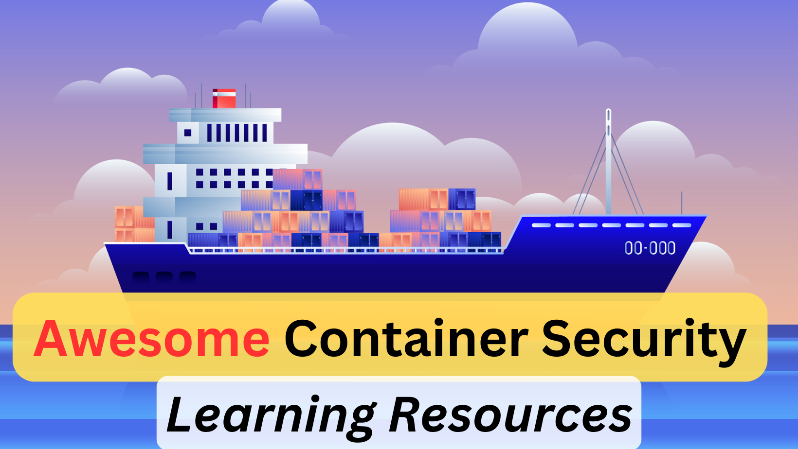

# Awesome Container Security Learning Resources

Container security covers the full lifecycle: image build (base image, Dockerfile hygiene, SBOM), image scanning (vulns, secrets, malware), registry security, runtime (Kubernetes/containerd), admission control, network policies, and supply-chain integrity (signing, provenance, SLSA).

## ToC
1. [Books](#books)
2. [Videos](#videos)
3. [Free/Paid Courses](#freepaid-courses)
4. [Free/Paid Labs](#freepaid-labs)
5. [Security Tools](#security-tools)
6. [Certifications](#certifications)
7. [Blogs/Articles](#blogsarticles)

## Books
1. [Container Security by Liz Rice (O'Reilly)](https://www.oreilly.com/library/view/container-security/9781492056690/) - The definitive introduction; covers namespaces, cgroups, capabilities, seccomp.
2. [Kubernetes Security and Observability by Brendan Creane, Amit Gupta (O'Reilly)](https://www.oreilly.com/library/view/kubernetes-security-and/9781098107093/)
3. [Hacking Kubernetes by Andrew Martin, Michael Hausenblas (O'Reilly)](https://www.oreilly.com/library/view/hacking-kubernetes/9781492081722/) - Offensive K8s perspective.
4. [Learn Kubernetes Security by Kaizhe Huang, Pranjal Jumde (Packt)](https://www.packtpub.com/product/learn-kubernetes-security/9781839216503)
5. [Docker Security by Adrian Mouat - free chapter](https://www.oreilly.com/library/view/using-docker/9781491915752/ch13.html)
6. [CIS Docker Benchmark (free)](https://www.cisecurity.org/benchmark/docker) - Bedrock controls for Docker.
7. [CIS Kubernetes Benchmark (free)](https://www.cisecurity.org/benchmark/kubernetes)
8. [NSA/CISA Kubernetes Hardening Guidance v1.2 (free)](https://media.defense.gov/2022/Aug/29/2003066362/-1/-1/0/CTR_KUBERNETES_HARDENING_GUIDANCE_1.2_20220829.PDF)

## Videos
1. [A Hacker's Guide to Kubernetes by Andrew Martin (KubeCon)](https://www.youtube.com/results?search_query=andrew+martin+hacking+kubernetes)
2. [Container Security at Scale - KubeCon / CloudNativeSecurityCon talks](https://www.youtube.com/@cncf/search?query=container+security)
3. [Liz Rice - Demo: A Container-Only Userspace](https://www.youtube.com/watch?v=8fi7uSYlOdc)
4. [Jay Beale - Attacking and Defending Kubernetes](https://www.youtube.com/results?search_query=jay+beale+kubernetes)
5. [Advanced Persistent Threats in Containers - Black Hat](https://www.youtube.com/results?search_query=black+hat+kubernetes)
6. [eBPF for Security - Falco & Tetragon talks](https://www.youtube.com/results?search_query=ebpf+security+falco+tetragon)

## Free/Paid Courses
1. [KodeKloud - Kubernetes Security (CKS path)](https://kodekloud.com/courses/kubernetes-security-cks)
2. [Killer.sh CKS simulator](https://killer.sh/) - Practice exam for the CKS.
3. [Linux Foundation - Kubernetes Security Essentials (LFS260)](https://training.linuxfoundation.org/training/kubernetes-security-essentials-lfs260/) - Official prep for CKS.
4. [Practical DevSecOps - Certified Container Security Expert (CCSE)](https://www.practical-devsecops.com/certified-container-security-expert/)
5. [Katacoda-style Kubernetes labs on KillerCoda](https://killercoda.com/) - free browser labs.
6. [SANS SEC584: Cloud Native Security](https://www.sans.org/cyber-security-courses/cloud-native-security-defending-containers-kubernetes/)
7. [Snyk - Container Security Fundamentals (free)](https://learn.snyk.io/)
8. [HackTricks Pentesting Kubernetes](https://cloud.hacktricks.xyz/pentesting-cloud/kubernetes-security)

## Free/Paid Labs
1. [Bust-a-Kube](https://github.com/controlplaneio/simulator) / [ControlPlane Simulator](https://github.com/controlplaneio/simulator) - Attack/defense K8s simulator.
2. [kube-goat by MadhuAkula](https://madhuakula.com/kubernetes-goat/) - Vulnerable-by-design Kubernetes cluster; hugely popular.
3. [Bust-a-Kube by Jay Beale](https://www.bustakube.com/) - Intentionally vulnerable K8s cluster.
4. [CNCF Capture the Flag - KubeCon archives](https://github.com/cncf/k8s-ctf)
5. [KillerCoda - Kubernetes playgrounds](https://killercoda.com/playgrounds)
6. [Docker vulnerable images list on Docker Hub](https://hub.docker.com/search?q=vulnerables) - useful for scanner testing.
7. [TryHackMe - Container / K8s rooms](https://tryhackme.com/)

## Security Tools
### Image & registry scanning
1. [Trivy by Aqua](https://github.com/aquasecurity/trivy) - De-facto open-source scanner for images, filesystems, repos, IaC and K8s.
2. [Grype + Syft by Anchore](https://github.com/anchore/grype) - Vuln scanner + SBOM generator.
3. [Clair by Quay/Red Hat](https://github.com/quay/clair)
4. [Docker Scout](https://docs.docker.com/scout/) - Built-in scanning in Docker Desktop/Hub.
5. [Snyk Container](https://snyk.io/product/container-vulnerability-management/)

### Dockerfile / config linting
6. [Hadolint](https://github.com/hadolint/hadolint) - Dockerfile linter.
7. [Dockle](https://github.com/goodwithtech/dockle) - Container image linter aligned with CIS Docker Benchmark.
8. [Checkov](https://github.com/bridgecrewio/checkov) - IaC + Dockerfile + K8s YAML scanning.
9. [KICS by Checkmarx](https://github.com/Checkmarx/kics)
10. [kube-linter by StackRox/Red Hat](https://github.com/stackrox/kube-linter)
11. [Polaris by Fairwinds](https://github.com/FairwindsOps/polaris)

### Runtime / detection
12. [Falco (CNCF graduated)](https://falco.org/) - Runtime threat detection via eBPF/syscalls.
13. [Tetragon by Isovalent](https://github.com/cilium/tetragon) - eBPF-based runtime security.
14. [Tracee by Aqua](https://github.com/aquasecurity/tracee)
15. [Sysdig Secure](https://sysdig.com/products/secure/)

### Kubernetes posture & audit
16. [kube-bench](https://github.com/aquasecurity/kube-bench) - CIS Kubernetes Benchmark scanner.
17. [kube-hunter](https://github.com/aquasecurity/kube-hunter) - External / internal K8s penetration scanner.
18. [kubeaudit by Shopify](https://github.com/Shopify/kubeaudit)
19. [kubescape by ARMO (CNCF incubating)](https://github.com/kubescape/kubescape) - Scans for NSA/MITRE/CIS frameworks.
20. [Starboard (now part of Trivy Operator)](https://github.com/aquasecurity/trivy-operator)
21. [Peirates](https://github.com/inguardians/peirates) - K8s penetration testing framework.

### Admission control & policy
22. [OPA / Gatekeeper](https://github.com/open-policy-agent/gatekeeper)
23. [Kyverno (CNCF)](https://kyverno.io/) - Kubernetes-native policy engine.
24. [Kubewarden](https://www.kubewarden.io/) - WASM-based admission policies.

### Network policy & service mesh security
25. [Cilium (CNCF)](https://cilium.io/) - eBPF networking + L7-aware network policies.
26. [Calico](https://www.tigera.io/project-calico/) - Network policy and security.
27. [Istio](https://istio.io/) - Service mesh with mTLS and authz.
28. [Linkerd](https://linkerd.io/) - Lightweight service mesh.

### Supply chain / SBOM / signing
29. [Sigstore: cosign, rekor, fulcio](https://www.sigstore.dev/) - Artifact signing.
30. [SLSA framework](https://slsa.dev/) - Supply-chain integrity levels.
31. [in-toto](https://in-toto.io/) - Supply-chain attestations.
32. [Grafeas](https://grafeas.io/) - Software supply-chain metadata API.
33. [Chainguard Images](https://www.chainguard.dev/chainguard-images) - Minimal, signed distroless-style base images.

### Container hardening / runtimes
34. [gVisor by Google](https://gvisor.dev/) - User-space kernel sandbox.
35. [Kata Containers](https://katacontainers.io/) - Lightweight VM-based container runtime.
36. [Bottlerocket OS by AWS](https://aws.amazon.com/bottlerocket/) - Minimal container-focused OS.

## Certifications
1. [CKS - Certified Kubernetes Security Specialist (CNCF/Linux Foundation)](https://www.cncf.io/training/certification/cks/) - The must-have cert for K8s security.
2. [KCSA - Kubernetes and Cloud Native Security Associate](https://www.cncf.io/training/certification/kcsa/) - Entry-level companion to CKS (launched 2024).
3. [KCNA - Kubernetes and Cloud Native Associate](https://www.cncf.io/training/certification/kcna/) - Foundational K8s knowledge.
4. [CKA - Certified Kubernetes Administrator](https://www.cncf.io/training/certification/cka/) - Not security-specific but prerequisite knowledge for CKS.
5. [CCSE - Certified Container Security Expert (Practical DevSecOps)](https://www.practical-devsecops.com/certified-container-security-expert/) - Teaches how to build secure container images and analyze their vulnerabilities.
6. [CCNSE - Certified Cloud-Native Security Expert (Practical DevSecOps)](https://www.practical-devsecops.com/certified-cloud-native-security-expert/) - Covers cloud-native security concepts including hacking and defending Kubernetes clusters, authentication, and authorization.
7. [Red Hat Certified Specialist in Containers and Kubernetes](https://www.redhat.com/en/services/certification/rhcs-containers-kubernetes)

## Blogs/Articles
1. [NSA/CISA Kubernetes Hardening Guide](https://media.defense.gov/2022/Aug/29/2003066362/-1/-1/0/CTR_KUBERNETES_HARDENING_GUIDANCE_1.2_20220829.PDF)
2. [OWASP Kubernetes Top 10](https://owasp.org/www-project-kubernetes-top-ten/)
3. [OWASP Docker Top 10](https://owasp.org/www-project-docker-top-10/)
4. [MITRE ATT&CK for Containers](https://attack.mitre.org/matrices/enterprise/containers/)
5. [Kubernetes Goat - vulnerabilities explained](https://madhuakula.com/kubernetes-goat/docs/)
6. [Aqua Security research blog](https://www.aquasec.com/blog/)
7. [Sysdig research blog](https://sysdig.com/blog/)
8. [Snyk container security learning hub](https://snyk.io/learn/container-security/)
9. [Red Hat - Kubernetes security best practices](https://www.redhat.com/en/topics/containers/kubernetes-security)
10. [Google - GKE hardening guide](https://cloud.google.com/kubernetes-engine/docs/how-to/hardening-your-cluster)
11. [Liz Rice - blog and talks](https://www.lizrice.com/)
12. [Raesene (Rory McCune) - Container/K8s security research](https://raesene.github.io/)
13. [ControlPlane research blog](https://control-plane.io/posts/)
14. [CNCF TAG-Security whitepapers](https://github.com/cncf/tag-security)
15. [Pod Security Standards](https://kubernetes.io/docs/concepts/security/pod-security-standards/) - Replaces deprecated PodSecurityPolicy.
16. [4Cs of cloud native security](https://kubernetes.io/docs/concepts/security/overview/) - Cloud, Cluster, Container, Code.
