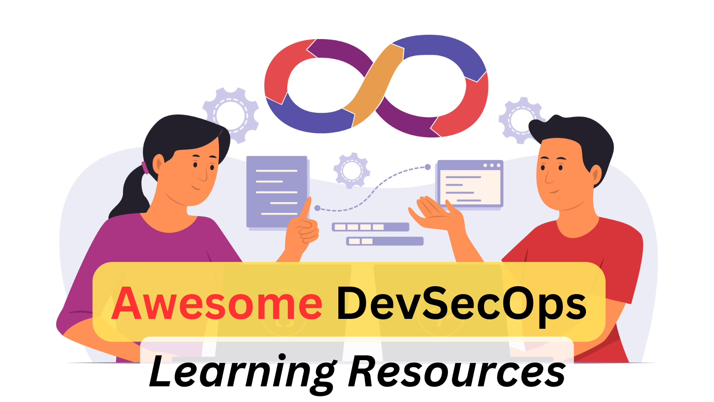

# Awesome DevSecOps Learning Resources

## ToC
1. [Books](#books)
2. [Videos](#videos)
3. [Free/Paid Courses](#freepaid-courses)
4. [Free/Paid Labs](#freepaid-devsecops-labs)
5. [DevSecOps Tools](#devsecops-tools)
6. [DevSecOps Certifications](#devsecops-certifications)
7. [Blogs/Articles](#blogsarticles)

## Books
Here are some DevSecOps learning resources to help you become a skilled DevSecOps engineer. They will boost your confidence in this domain, and you will be ready to explore further.

1. [The Phoenix Project by Gene Kim](https://amzn.to/4gJRYqr) — A novel that illustrates how DevOps principles can transform IT operations and business performance. I would highly recommend this book to every IT professional specially Developers, QA, Infra engineers, DevOps, and security folks. 
2. [Learning DevSecOps](https://amzn.to/4eq4dHs) — A practical guide to integrating security into DevOps pipelines to deliver secure software faster. Quite a new release (published in May 2024)
3. [Securing DevOps: Securing in the cloud](https://amzn.to/3Y0IIqN) - It explores modern DevOps security techniques and tools to secure cloud environments. It is one of the books that I have read in the past. 
4. [Security in DevOps by PackT](https://amzn.to/4ehvc7Q) — Comprehensive strategies for embedding security into DevOps workflows. 
5. [Agile Application Security](https://amzn.to/3ZLzRui) — A guide to building secure applications with agile methodologies. Being a DevSecOps engineer, you should have a fair idea of AppSec.

## Videos

## Free/Paid Courses
1. [DevSecOps Fundamentals on Udemy](https://www.udemy.com/course/devsecops-fundamentals/) -  A beginner’s course on understanding and implementing DevSecOps practices in software development. 
2. [DevSecOps for Absolute Beginners](https://www.udemy.com/course/devsecops-essentials-beginner-to-advanced-hands-on-demos/) - An introductory course for those new to DevSecOps, covering key concepts and tools. 
3. [DevSecOps by KodeCloud](https://kodekloud.com/courses/devsecops) - A practical course on mastering DevSecOps tools and methodologies with hands-on labs. You should try it.

## Free/Paid DevSecOps Labs
1. [DevSecOps Integra project](https://github.com/teacheraio/DevSecOps-Integra)
2. [DevSec Hardening project](https://github.com/dev-sec/linux-hardening)
3. [DevSecOps projects](http://devsecops.github.io/)
4. [DevSecOps Playbook](https://github.com/vermava/DevSecOps-Playbook)
5. [DevSecOps Bootcamp](https://github.com/devsecops/bootcamp)

## DevSecOps Certifications
1. [CDP by Practical DevSecOps](https://www.practical-devsecops.com/certified-devsecops-professional/) — Certified DevSecOps Professional, a hands-on certification focused on applying security in DevOps practices. [I had given my feedback after this examination in 2020](https://jassics.medium.com/certified-devsecops-professional-cdp-course-and-exam-review-2ea22938bd10)
2. [DevSecOps Essentials by EC-Council](https://www.eccouncil.org/train-certify/devsecops-essentials-dse/) — A foundational certification covering essential skills and knowledge for implementing security in DevOps.
3. [E|CDE by EC-Council](https://www.eccouncil.org/train-certify/certified-devsecops-engineer-ecde/) — EC-Council Certified DevSecOps Engineer, designed for professionals aiming to integrate security into DevOps environments.

## Blogs/Articles
Blog, articles, and other relevant learning resources
1. [DevSecOps University by Practical devSecOps](https://www.practical-devsecops.com/devsecops-university/)
2. [OWASP DevSecOps Maturity Model](https://dsomm.timo-pagel.de/)
3. [What Security Engineer should learn from DevSecOps](https://segment.com/blog/shifting-engineering-right/)
4. [Introduction to DevSecOps](https://dzone.com/refcardz/introduction-to-devsecops)
5. [Security in DevOps: Staying secure in agile development](https://christian-schneider.net/slides/OWASP-AppSecEU-2015_SecDevOps.pdf)
## DevSecOps Tools
**DevSecOps tools can be categorised into several groups based on their functionality.**

These categories include:

### Static Application Security Testing (SAST) Tools
1. Sonarqube: Static code analysis tool supporting multiple programming languages.
2. Bandit: A security linter for Python
3. Brakeman: Security scanner for Ruby on Rails applications.
4. SpotBugs: Static analysis tool to find security vulnerabilities in Java code
5. Semgrep: Lightweight static analysis tool supporting multiple languages and frameworks
6. Coverity: Comprehensive static code analysis to detect software defects and vulnerabilities.

### Secrets Scanning Tools
1. git-secrets: Detects secrets and sensitive information within git commits and prevents them from being included.
2. Trufflehog
3. Talisman
4. Whispers
5. gitleaks

### Secrets Management Tools
1. HashiCorp Vault
2. CyberArk Conjur
3. AWS Secrets Manager
4. Azure Key Vault

### Dynamic Application Security Testing (DAST) Tools
1. OWASP ZAP: Open-source tool used to find vulnerabilities in web applications. 
2. Nikto: Web server scanner that detects outdated versions and security issues. 
3. Arachni: Web application security scanner for identifying vulnerabilities. 
4.Burp Suite: Integrated platform for performing security testing of web applications. 
5. Akto and Levo (API Security): Tools designed to scan and secure APIs.

### Software Composition Analysis (SCA) Tools
1. Snyk: Security platform that scans open-source dependencies for known vulnerabilities.
2. OWASP Dependency-Check: Open-source tool to identify publicly disclosed vulnerabilities in dependencies.
3. Dependabot: Automatically checks dependencies for vulnerabilities and sends pull requests to update them.
4. Retire.js: Scanner that helps identify known vulnerabilities in JavaScript libraries.
5. npm audit: Security audit tool for Node.js applications, focusing on package vulnerabilities.

### Container Security Tools
1. Clair: Open-source tool for the static analysis of vulnerabilities in containers.
2. Trivy: Comprehensive vulnerability scanner for containers, Kubernetes, and IaC.
3. Checkov: Infrastructure is a code static analysis tool for Terraform, Kubernetes, and more.
4. Kube-bench: Checks whether Kubernetes clusters are deployed according to security best practices.
5. Kubesec: Tool to secure Kubernetes resources by scanning YAML files.
6. Hadolint: Dockerfile linter will check for best practices and potential vulnerabilities.
7. Twistlock

### Infrastructure as Code (IaC) Security Tools
1. Terraform-grunt: Tool to test the security of Terraform configurations.
2. ScoutSuite: Multi-cloud security auditing tool for cloud infrastructure.
3. Kics by Checkmarx: Open-source IaC scanning tool for identifying vulnerabilities.
4. TFLint: Linter to detect errors and security issues in Terraform templates.
5. Prowler: Security tool to perform AWS security best practices checks.
6. Terrascan: A static code analyzer for IaC that detects vulnerabilities.

### Compliance and Governance Tools
Think of policy as code and compliance as code from a DevOps and DevSecOps perspective.

1. Chef Inspec: Framework for defining and testing security and compliance policies as code.
2. Open Policy Agent (OPA): General-purpose policy engine for enforcing policies across the stack.
3. HashiCorp Sentinel: Policy-as-code framework integrated with HashiCorp products.
4. AWS Config: Monitors and audits the configuration of AWS resources to maintain compliance.
5. OpenSCAP: Suite of open-source tools for auditing compliance with security standards.

### Security Dashboard and Analytics Tools
1. DefectDojo: Open-source application vulnerability management tool.
2. ELK: Elasticsearch, Logstash, and Kibana stack for centralized logging and analytics.
3. OWASP dependency Track: Continuous monitoring of vulnerabilities in third-party dependencies.
4. JFrog XRay: Universal component analysis tool to detect vulnerabilities and license compliance issues.
