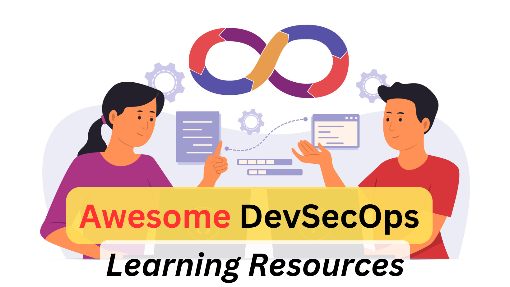

# Awesome DevSecOps Learning Resources

## ToC
1. [Books](#books)
2. [Videos](#videos)
3. [Free/Paid Courses](#freepaid-courses)
4. [Free/Paid Labs](#freepaid-devsecops-labs)
5. [DevSecOps Tools](#devsecops-tools)
6. [DevSecOps Certifications](#devsecops-certifications)
7. [Blogs/Articles](#blogsarticles)

## Books
Here are some DevSecOps learning resources to help you become a skilled DevSecOps engineer. They will boost your confidence in this domain, and you will be ready to explore further.

1. [The Phoenix Project by Gene Kim](https://amzn.to/4gJRYqr) — A novel that illustrates how DevOps principles can transform IT operations and business performance. I would highly recommend this book to every IT professional specially Developers, QA, Infra engineers, DevOps, and security folks. 
2. [Learning DevSecOps](https://amzn.to/4eq4dHs) — A practical guide to integrating security into DevOps pipelines to deliver secure software faster. Quite a new release (published in May 2024)
3. [Securing DevOps: Securing in the cloud](https://amzn.to/3Y0IIqN) - It explores modern DevOps security techniques and tools to secure cloud environments. It is one of the books that I have read in the past. 
4. [Security in DevOps by PackT](https://amzn.to/4ehvc7Q) — Comprehensive strategies for embedding security into DevOps workflows. 
5. [Agile Application Security](https://amzn.to/3ZLzRui) — A guide to building secure applications with agile methodologies. Being a DevSecOps engineer, you should have a fair idea of AppSec.

## Videos
1. [DevSecOps Explained in 5 Minutes](https://www.youtube.com/watch?v=nrhxNNH5lt0)
2. [DevSecOps - What, Why and How by Anant Shrivastava (Null)](https://www.youtube.com/results?search_query=devsecops+anant+shrivastava)
3. [DevSecCon talks (official channel)](https://www.youtube.com/@DevSeconHQ)
4. [All Day DevOps - Security track archives](https://www.alldaydevops.com/ondemand)
5. [Shifting left on security - OWASP AppSec talks](https://www.youtube.com/@owasp)
6. [DevSecOps at scale - Netflix / Shopify / GitHub engineering talks](https://www.youtube.com/results?search_query=devsecops+engineering+scale)

## Free/Paid Courses
1. [DevSecOps Fundamentals on Udemy](https://www.udemy.com/course/devsecops-fundamentals/) -  A beginner’s course on understanding and implementing DevSecOps practices in software development. 
2. [DevSecOps for Absolute Beginners](https://www.udemy.com/course/devsecops-essentials-beginner-to-advanced-hands-on-demos/) - An introductory course for those new to DevSecOps, covering key concepts and tools. 
3. [DevSecOps by KodeCloud](https://kodekloud.com/courses/devsecops) - A practical course on mastering DevSecOps tools and methodologies with hands-on labs. You should try it.

## Free/Paid DevSecOps Labs
1. [DevSecOps Integra project](https://github.com/teacheraio/DevSecOps-Integra)
2. [DevSec Hardening project](https://github.com/dev-sec/linux-hardening) - Ansible/Chef/Puppet baselines for Linux/Windows hardening.
3. [DevSecOps Playbook](https://github.com/6mile/DevSecOps-Playbook) - Widely-shared playbook (note: Vermava fork may be outdated).
4. [DevSecOps Bootcamp](https://github.com/devsecops/bootcamp)
5. [Practical DevSecOps - free labs (require signup)](https://www.practical-devsecops.com/)
6. [Vulnerable Pipeline / AWSGoat / IaCGoat](https://github.com/ine-labs) - INE Labs' intentionally vulnerable CI/CD and IaC.
7. [OWASP WrongSecrets](https://github.com/OWASP/wrongsecrets) - Hands-on secrets-management lab.

## DevSecOps Certifications
1. [CDP by Practical DevSecOps](https://www.practical-devsecops.com/certified-devsecops-professional/) — Certified DevSecOps Professional, covers DevSecOps basics with a focus on secure SDLC and CI/CD pipelines. Includes SCA, SAST, DAST, and Security as Code. [Exam review (2020)](https://jassics.medium.com/certified-devsecops-professional-cdp-course-and-exam-review-2ea22938bd10)
2. [CDE by Practical DevSecOps](https://www.practical-devsecops.com/certified-devsecops-expert/) — Certified DevSecOps Expert, goes deeper into OS hardening, infrastructure and code compliance, vulnerability management, and automation.
3. [CSSE by Practical DevSecOps](https://www.practical-devsecops.com/certified-software-supply-chain-security-expert/) — Certified Software Supply Chain Security Expert, covers how organizations protect against software supply chain attacks and how to assess and reduce related risks.
4. [CSC by Practical DevSecOps](https://www.practical-devsecops.com/certified-security-champion/) — Certified Security Champion, focuses on identifying and fixing code vulnerabilities using CI/CD tools to strengthen pipeline security.
5. [DevSecOps Essentials by EC-Council](https://www.eccouncil.org/train-certify/devsecops-essentials-dse/) — A foundational certification covering essential skills and knowledge for implementing security in DevOps.
6. [E|CDE by EC-Council](https://www.eccouncil.org/train-certify/certified-devsecops-engineer-ecde/) — EC-Council Certified DevSecOps Engineer, designed for professionals aiming to integrate security into DevOps environments.

## Blogs/Articles
Blog, articles, and other relevant learning resources
1. [DevSecOps University by Practical DevSecOps](https://www.practical-devsecops.com/devsecops-university/)
2. [OWASP DevSecOps Maturity Model (DSOMM)](https://dsomm.owasp.org/)
3. [OWASP DevSecOps Guideline](https://owasp.org/www-project-devsecops-guideline/)
4. [OWASP CI/CD Security Top 10](https://owasp.org/www-project-top-10-ci-cd-security-risks/)
5. [SLSA - Supply-chain Levels for Software Artifacts](https://slsa.dev/)
6. [Introduction to DevSecOps - DZone refcard](https://dzone.com/refcardz/introduction-to-devsecops)
7. [Google SRE - Building Secure and Reliable Systems (free book)](https://sre.google/books/building-secure-reliable-systems/)
8. [NIST SP 800-218 - Secure Software Development Framework (SSDF)](https://csrc.nist.gov/Projects/ssdf)
9. [NSA/CISA - Securing the Software Supply Chain series](https://www.cisa.gov/resources-tools/resources/securing-software-supply-chain-recommended-practices-developers)
10. [Sigstore - keyless signing](https://www.sigstore.dev/)
11. [Shifting left vs shifting everywhere (Maya Kaczorowski)](https://www.mayakaczorowski.com/)
12. [Boring AppSec newsletter](https://boringappsec.substack.com/)
13. [SolarWinds, Codecov, 3CX - supply-chain attack post-mortems (read all of them)](https://www.cisa.gov/topics/cyber-threats-and-advisories)

## DevSecOps Tools
**DevSecOps tools can be categorised into several groups based on their functionality.**

These categories include:

### Static Application Security Testing (SAST) Tools
1. [SonarQube](https://www.sonarsource.com/products/sonarqube/): Static code analysis tool supporting multiple programming languages.
2. [Bandit](https://github.com/PyCQA/bandit): A security linter for Python.
3. [Brakeman](https://brakemanscanner.org/): Security scanner for Ruby on Rails applications.
4. [SpotBugs + find-sec-bugs plugin](https://find-sec-bugs.github.io/): Static analysis tool to find security vulnerabilities in Java code.
5. [Semgrep](https://semgrep.dev/): Lightweight static analysis tool supporting multiple languages and frameworks.
6. [CodeQL by GitHub](https://codeql.github.com/): Semantic code analysis, free for open source.
7. [Coverity (Black Duck)](https://www.blackduck.com/static-analysis-tools-sast/coverity.html): Comprehensive commercial SAST.
8. [Checkmarx One](https://checkmarx.com/) / [Veracode](https://www.veracode.com/) / [Snyk Code](https://snyk.io/product/snyk-code/): Commercial SAST options.
9. [gosec](https://github.com/securego/gosec): Go security checker.
10. [njsscan](https://github.com/ajinabraham/njsscan) / [nodejsscan](https://github.com/ajinabraham/nodejsscan): Node.js SAST.

### Secrets Scanning Tools
1. [git-secrets](https://github.com/awslabs/git-secrets): Detects secrets in git commits and prevents them from being included.
2. [TruffleHog](https://github.com/trufflesecurity/trufflehog): Finds and verifies secrets in git history, files, cloud, chats.
3. [gitleaks](https://github.com/gitleaks/gitleaks): Fast SAST secrets scanner.
4. [detect-secrets by Yelp](https://github.com/Yelp/detect-secrets): Baseline-driven secrets detection.
5. [Talisman](https://github.com/thoughtworks/talisman): Pre-commit hook for secrets.
6. [Whispers](https://github.com/Skyscanner/whispers): Structured-config secrets scanner.
7. [GitGuardian](https://www.gitguardian.com/): Commercial secrets scanning at scale.

### Secrets Management Tools
1. [HashiCorp Vault](https://www.vaultproject.io/)
2. [CyberArk Conjur](https://www.conjur.org/)
3. [AWS Secrets Manager](https://aws.amazon.com/secrets-manager/) / [AWS SSM Parameter Store](https://docs.aws.amazon.com/systems-manager/latest/userguide/systems-manager-parameter-store.html)
4. [Azure Key Vault](https://azure.microsoft.com/en-us/products/key-vault)
5. [Google Cloud Secret Manager](https://cloud.google.com/secret-manager)
6. [Doppler](https://www.doppler.com/), [Infisical](https://infisical.com/), [1Password Secrets Automation](https://1password.com/developers/secrets-automation/)
7. [External Secrets Operator (Kubernetes)](https://external-secrets.io/)
8. [SOPS by Mozilla](https://github.com/getsops/sops): Encrypted files for GitOps.

### Dynamic Application Security Testing (DAST) Tools
1. [OWASP ZAP](https://www.zaproxy.org/): Open-source web application scanner; supports automation and API scanning.
2. [Nuclei](https://github.com/projectdiscovery/nuclei): Template-based fast scanner; widely used in CI.
3. [Nikto](https://cirt.net/Nikto2): Web server scanner.
4. [Burp Suite (Community / Professional / Enterprise)](https://portswigger.net/burp): Industry-standard web/API testing.
5. [Arachni (maintenance mode)](https://www.arachni-scanner.com/): Still usable but not actively maintained.
6. [StackHawk](https://www.stackhawk.com/): DAST tuned for CI/CD pipelines.
7. [Akto](https://github.com/akto-api-security/akto), [Levo.ai](https://www.levo.ai/), [42Crunch](https://42crunch.com/): API-centric DAST.

### Software Composition Analysis (SCA) Tools
1. Snyk: Security platform that scans open-source dependencies for known vulnerabilities.
2. OWASP Dependency-Check: Open-source tool to identify publicly disclosed vulnerabilities in dependencies.
3. Dependabot: Automatically checks dependencies for vulnerabilities and sends pull requests to update them.
4. Retire.js: Scanner that helps identify known vulnerabilities in JavaScript libraries.
5. npm audit: Security audit tool for Node.js applications, focusing on package vulnerabilities.

### Container Security Tools
See also the dedicated [Container Security learning resources](awesome-container-security-learning-resources.md).
1. [Trivy](https://github.com/aquasecurity/trivy): Comprehensive vulnerability scanner for containers, Kubernetes, IaC, filesystem and git repos.
2. [Grype + Syft](https://github.com/anchore) by Anchore: Vulnerability scanner + SBOM generator.
3. [Clair](https://github.com/quay/clair): Static analysis of vulnerabilities in containers (used by Quay).
4. [Checkov](https://www.checkov.io/): IaC + Dockerfile + K8s YAML static analysis.
5. [Docker Scout](https://docs.docker.com/scout/): Built-in scanning.
6. [Kube-bench](https://github.com/aquasecurity/kube-bench): CIS Kubernetes Benchmark scanner.
7. [kube-hunter](https://github.com/aquasecurity/kube-hunter): Kubernetes penetration scanner.
8. [Kubesec](https://kubesec.io/): Scans YAML for risky settings.
9. [Hadolint](https://github.com/hadolint/hadolint) and [Dockle](https://github.com/goodwithtech/dockle): Dockerfile/image linters.
10. [Falco (CNCF)](https://falco.org/): Runtime threat detection.
11. [Prisma Cloud (formerly Twistlock)](https://www.paloaltonetworks.com/prisma/cloud): Commercial CWPP/CNAPP.

### Infrastructure as Code (IaC) Security Tools
1. [Checkov by Bridgecrew/Prisma](https://www.checkov.io/): Terraform, CloudFormation, Kubernetes, Dockerfile, ARM, Bicep, Serverless.
2. [KICS by Checkmarx](https://github.com/Checkmarx/kics): Open-source IaC scanner.
3. [tfsec (now part of Trivy)](https://github.com/aquasecurity/tfsec): Terraform-specific.
4. [Terrascan by Tenable](https://github.com/tenable/terrascan): Multi-IaC static analyzer.
5. [TFLint](https://github.com/terraform-linters/tflint): Terraform linter with security rules via plugins.
6. [Prowler](https://github.com/prowler-cloud/prowler): AWS/Azure/GCP/K8s posture scanner.
7. [ScoutSuite](https://github.com/nccgroup/ScoutSuite): Multi-cloud security auditing.
8. [cfn-nag](https://github.com/stelligent/cfn_nag): AWS CloudFormation linter.
9. [OPA Conftest](https://www.conftest.dev/): Policy-as-code for any config format.

### Compliance and Governance Tools
Think of policy as code and compliance as code from a DevOps and DevSecOps perspective.

1. [Chef InSpec](https://www.inspec.io/): Framework for defining and testing security/compliance policies as code.
2. [Open Policy Agent (OPA)](https://www.openpolicyagent.org/): General-purpose policy engine for enforcing policies across the stack.
3. [HashiCorp Sentinel](https://www.hashicorp.com/sentinel): Policy-as-code for HashiCorp products.
4. [AWS Config](https://aws.amazon.com/config/) / [Azure Policy](https://learn.microsoft.com/en-us/azure/governance/policy/overview) / [GCP Organization Policy](https://cloud.google.com/resource-manager/docs/organization-policy/overview).
5. [OpenSCAP](https://www.open-scap.org/): Auditing compliance with SCAP standards.
6. [Kyverno](https://kyverno.io/) / [Gatekeeper (OPA)](https://open-policy-agent.github.io/gatekeeper/): Kubernetes admission policy.
7. [Cloud Custodian](https://cloudcustodian.io/): Rules engine for multi-cloud governance.

### Security Dashboard and Analytics Tools
1. [DefectDojo](https://www.defectdojo.org/): Open-source application vulnerability management (ASOC/ASPM).
2. [OWASP Dependency-Track](https://dependencytrack.org/): Continuous SBOM + vulnerability monitoring.
3. [Faraday](https://faradaysec.com/): Collaborative pentest/vulnerability management.
4. [ArcherySec](https://github.com/archerysec/archerysec): Open-source vuln assessment & management.
5. [JFrog Xray](https://jfrog.com/xray/): Universal component analysis (vulns + licenses).
6. [ELK / OpenSearch / Grafana Loki](https://www.elastic.co/): Centralized logging and analytics.

### Software Supply Chain / SBOM / Signing
1. [Sigstore (cosign, rekor, fulcio)](https://www.sigstore.dev/): Keyless artifact signing.
2. [SLSA framework](https://slsa.dev/): Supply-chain integrity levels.
3. [in-toto](https://in-toto.io/): Supply-chain attestations.
4. [Syft](https://github.com/anchore/syft) / [CycloneDX CLI](https://github.com/CycloneDX/cyclonedx-cli) / [SPDX tools](https://spdx.dev/): SBOM generation.
5. [Dependency-Track](https://dependencytrack.org/): SBOM consumption and monitoring.
6. [GUAC by OpenSSF](https://guac.sh/): Graph for Understanding Artifact Composition.
7. [Scorecards by OpenSSF](https://github.com/ossf/scorecard): Security posture of OSS projects.
