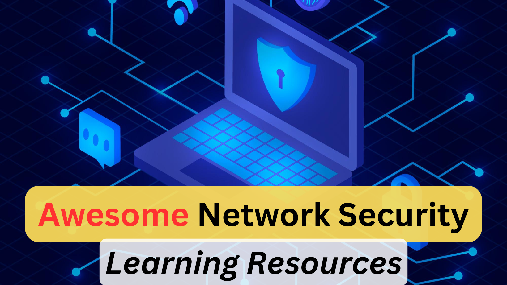

# Awesome Network Security Learning Resources

## ToC
1. [Books](#books)
2. [Videos](#videos)
3. [Free/Paid Courses](#freepaid-courses)
4. [Free/Paid Labs](#freepaid-labs)
5. [Network Security Tools](#network-security-tools)
6. [Certifications](#certifications)
7. [Blogs/Articles](#blogsarticles)

## Books
1. [Cryptography and Network Security by Forouzan](https://amzn.to/3Y999KS)
2. [Real World Cryptography](https://amzn.to/3TStBNO)

## Videos

## Free/Paid Courses
1. [Coursera: Network Security & Database Vulnerabilities (Free/Paid)](https://www.coursera.org/learn/network-security-database-vulnerabilities) - 
This course covers core principles of network security, network vulnerabilities, and countermeasures. 
2. [Cybrary: Network Security Fundamentals](https://www.cybrary.it/course/cyber-network-security) - 
Free video-based training on network security basics, threat modeling, and various network attack methods.
3. [Udemy: The Complete Cyber Security Course - Network Security (Paid)](https://www.udemy.com/course/network-security-course/?couponCode=LEARNNOWPLANS) - 
Comprehensive course on network security, including encryption, VPNs, firewalls, and malware protection.
4. [edX: Network Security (Paid)](https://www.edx.org/learn/network-security/rochester-institute-of-technology-network-security) - 
A full course that covers network security principles, including firewalls, intrusion detection, and more.

## Free/Paid Labs
1. TryHackMe
2. HackTheBox
3. [Cisco Networking Academy Labs (Free)](https://www.netacad.com/) - Free labs covering network security principles, firewall configurations, and intrusion prevention systems.
4. [Pentester Academy (Paid)](https://www.pentesteracademy.com/) - A paid service offering network labs focused on penetration testing, network security analysis, and malware forensics.

## Network Security Tools
1. nmap
2. wireshark
3. openVAS
4. snort
5. netcat
6. metasploit
7. kismet
8. ettercap
9. Nessus
10. aircrack-ng
11. openssl
12. Nagios

## Certifications
1. SSCP by ISC2
2. Network+ by CompTIA
3. EC-Council Certified Network Defender
3. OSCP
4. Cisco Certified CyberOps Associate 
5. CCNP-Security

## Blogs/Articles