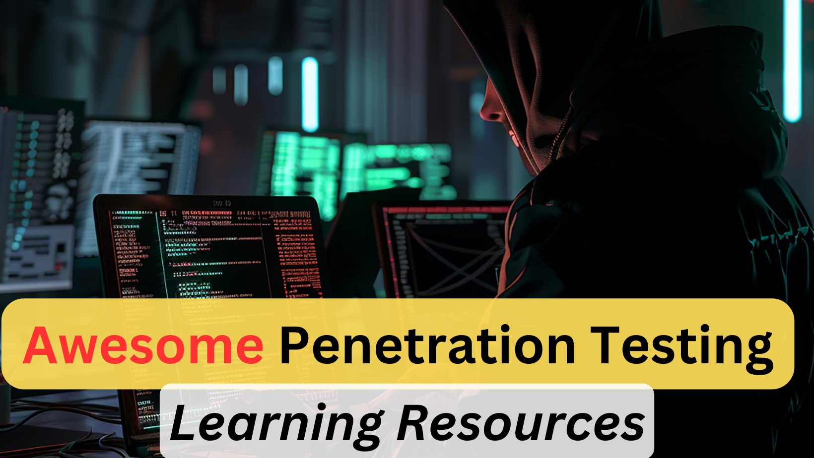

# Awesome Penetration Testing Learning Resources (Web Security)
**It covers web security majorly**

## ToC
1. [Books](#books)
2. [Videos](#videos)
3. [Free/Paid Courses](#freepaid-coursestutorials)
4. [Free/Paid Labs](#freepaid-labs)
5. [Web Security Tools](#web-security-tools)
6. [Certifications](#certifications)
7. [Blogs/Articles](#blogsarticles)

## Books
1. [The Web Application Hacker's Handbook](https://amzn.to/3YddCfR)
2. [Web Security Testing Guide](https://owasp.org/www-project-web-security-testing-guide/stable/)
3. [OWASP Testing guide v4 in pdf](https://owasp.org/www-project-web-security-testing-guide/assets/archive/OWASP_Testing_Guide_v4.pdf)

## Videos
1. [Web Security Tutorials for Beginners](https://www.youtube.com/watch?v=XOlg8yyoumY)
2. [Web Security Fundamentals for Beginners](https://www.youtube.com/watch?v=44l3h0FAcOw)
3. [CS 253 Web Security form Stanford](https://www.youtube.com/playlist?list=PL1y1iaEtjSYiiSGVlL1cHsXN_kvJOOhu-)

## Free/Paid Courses/Tutorials
1. [CS253: Web Security from Stanford University](https://www.youtube.com/playlist?list=PL1y1iaEtjSYiiSGVlL1cHsXN_kvJOOhu-)
2. [CS253: Reading materials](https://web.stanford.edu/class/cs253/)
3. [WebApp Security bootcamp](https://attackdefense.com/listing?labtype=webapp-security-bootcamp&subtype=webapp-security-bootcamp-recordings)
4. [Web Security Academy](https://portswigger.net/web-security)

## Free/Paid Labs
1. [OWASP WebGoat](https://owasp.org/www-project-webgoat/)
2. [OWASP Juice Shop](https://owasp.org/www-project-juice-shop/)
3. [This is Legal app](https://thisislegal.com/)
4. [Hack This Site](https://www.hackthissite.org/)
5. [Google Gruyere](https://google-gruyere.appspot.com/)
6. [Damn Vulnerable Web Application (DVWA)](https://github.com/digininja/DVWA/)

## Web Security Tools
1. [Nikto: Web server scanner](https://www.kali.org/tools/nikto/)
2. [fierce: DNS reconnaissance tool for discovering subdomains and potential attack vectors](https://www.kali.org/tools/fierce/)
3. [owaspZAP (OWASP Zed Attack Proxy): Open-source web application scanner for finding vulnerabilities and testing app security.](https://www.zaproxy.org/)
4. [BurpSuite: Comprehensive web security testing tool for performing vulnerability scans, manual testing, and exploitation.](https://portswigger.net/burp/communitydownload)
6. [sqlmap: Open-source tool that automates the detection and exploitation of SQL injection vulnerabilities.](https://www.kali.org/tools/sqlmap/)
7. [w3af: Web application attack and audit framework that helps identify and exploit vulnerabilities.](https://docs.w3af.org/en/latest/)
8. [BeEF (Browser Exploitation Framework): Tool for targeting and exploiting vulnerabilities in web browsers.](https://beefproject.com/)
9. [Pentest Tools](https://pentest-tools.com/alltools#web-vulnerability-scanners)
11. [Acunetix: Automated web application security testing tool - paid tool by invicti (formerly NetSparker)](https://www.acunetix.com/)
12. [Wfuzz: Web application security bruteforcing tool. Great for fuzzing](https://www.kali.org/tools/wfuzz/)
13. [Amass: Subdomain enumeration and attack surface mapping.](https://www.kali.org/tools/amass/)
14. [Dirb: Web content discovery scanner using a directory file](https://www.kali.org/tools/dirb/)
15. [WhatWeb: Web application fingerprinting tool](https://www.kali.org/tools/whatweb/)
16. [WPScan: WordPress vulnerability scanner for installed plugins](https://www.kali.org/tools/wpscan/)
17. [XSStrike: XSS vulnerability scanner by Somdev Sangwan](https://github.com/s0md3v/XSStrike)
18. [HTTrack: Website copier tool or an offline browser utility](https://www.kali.org/tools/httrack/)
19. [nmap: Network discovery and security auditing tool.](https://nmap.org/book/man.html)

## Certifications
1. OSCP by Offensive Security
2. OSWE by Offensive Security
3. GWEB by SANS
4. GWAPT by SANS
5. eWPT by eLearnSecurity
6. CEWPT by Mile2
7. WAPT by 7Safe

## Blogs/Articles
1. [OWASP Cheatsheet Series](https://cheatsheetseries.owasp.org/)
2. [OWASP Top 10 related cheatsheet](https://cheatsheetseries.owasp.org/IndexTopTen.html)
3. [Implementation of CSP](https://content-security-policy.com/)
4. [Prototype Pollution](https://portswigger.net/web-security/prototype-pollution)
5. [Hackerone’s hacktivity](https://hackerone.com/hacktivity/overview)
6. [Awesome Bug bounty writeup](https://github.com/devanshbatham/Awesome-Bugbounty-Writeups)
7. [log4j pentesting](https://www.hackingarticles.in/a-detailed-guide-on-log4j-penetration-testing/)